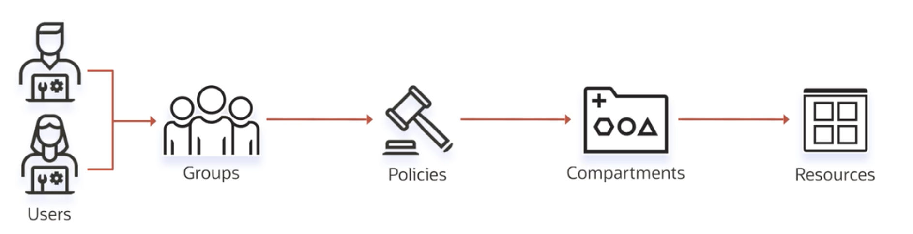
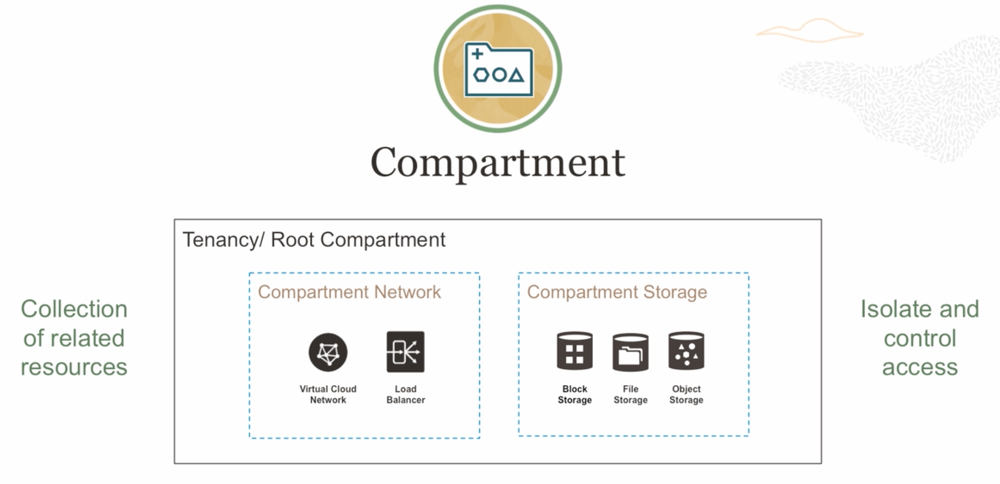

# IAM - Identity and Access Management Service

## OCI Identity Concepts

Users -> Groups -> Policies -> Compartments -> Resources



## How To identify Resources?

OCI Resources -> OCID - Oracle Cloud ID
````
ocid.<resource type>.<realm>.[Region].[.FutureUse].<UniqueID>
````
## Authentication in OCI

AuthN -> Autentication (Autenticação)
Identify who you are

- API  Signing Key
- Auth Token
- User and Password

## Authorization in OCI

AuthZ -> Policies (autorização)
What permissions do you have?

Verbs
- Manage
- Use
- Read
- Inspect

*Everything is negated by default*

Eg.
````
Allow <group_name> to <verb> <resource-type> in <location> where <conditions>
````

## Compartments



Root Compartment -> All Resources of your Account

Compartment -> Isolation of resources

Each resource belongs to a single compartment.
Resources can interact with other resources in different compartments.
Resources can be move from one compartment to another.
Compartments are Global, Belong to Multiple Regions.
Set Quotas and Budgets on Compartment.

Compartments -> Six Levels of Nesting (aninhamento)

Groups + Policies = Access to Compartments (Control Access to resources)

# Questions

Which statement is true about OCI Identity and Access Management (IAM)?
- It enables only authorization for the tenancy.
- It enables bring-your-own-devices.
- **It is used to control access to resources.** -> IAM lets you control who has access to your cloud resources.
- It enables only authentication for the tenancy.

Which is NOT a valid method for authenticating a Principal in OCI Identity and Access Management (IAM) service?
- API Signing Key
- **OCI Vault Master Encryption Keys** -> Vault is not a valid authentication method
- Console user name, Password
- Auth Tokens

How is a resource in OCI identified?
- Tenancy ID
- **OCID** -> Most types of Oracle Cloud Infrastructure resources have a unique, Oracle-assigned identifier called an Oracle Cloud ID (OCID).
- Username
- Compartment Name

Which feature of OCI Identity and Access Management (IAM) service specifies authorization for various actions for authenticated Principals?
- Role
- **Policy** -> IAM Policies are used to specify authorization.
- Compartment
- Group

Which is NOT a valid statement regarding OCI Compartments?
- **Compartments are restricted to a single region.** -> Compartments are global and not tied to a specific region
- Each resource belongs to a single compartment.
- Resources can interact with other resources in different compartments.
- You can give group of users access to compartments by writing policies.
