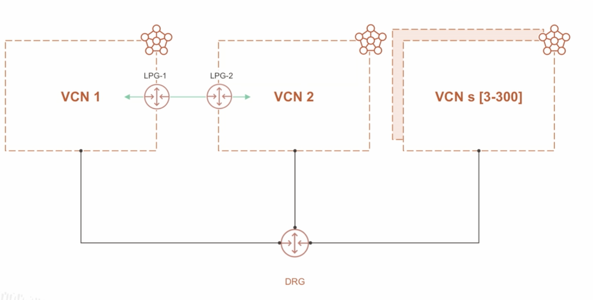

# VCN - Virtual Cloud Network

* Regionanl Service
* Connection between instances
* High Availability
* Scalable
* Secure

Reserve 3 address for Network, Gateway and Broadcast

Limits:
* 200 VCN's per region
* 300 subnets per VCN

Connections:
* Internet Gateway
* Nat Gateway
* Service Gateway

## Types of Public IPs

There are two types of public IPs:

Ephemeral:
* Think of it as temporary and existing for the lifetime of the instance.

Reserved:
* Think of it as persistent and existing beyond the lifetime of the instance it's assigned to. You can unassign it and then reassign it to another instance whenever you like. Exception: reserved public IPs on public load balancers

## Internet Gateway

* Direct internet connection
* Two-way traffic

## NAT Gateway - Network Adress Translate Gateway

* Traffic one-way

## Service Gateway

Gateway to oracle cloud services such as object storage and others
(public services OCI)

## Dynamic Routing Gateway

Interconnect VCN's

* VPN's Site-to-Site
* Network on-premisses
* Fastconnect

# OCI Route

## Route-Tables

* Internet
* On-Premisses Network
* Peered VCN's

Destination CIDR, Route Target (Next Hop)
Traffic between public/private subnets is not routed

## Local Peering -> LPG
between VCN's in the same region.

## Remote Peering -> DRG
between VCN's in different regions.

## DRGv2 Dynamic Routing Gateway

VCN's interconnection, dynamic not static.
Maximum of 300 VCN's per DRGv2

# VCN Security

## Secure Lists

* Firewal Rules
* Rules of traffic

Applied In VCN's

* Statefull -> rules auto ingress/egress
* Stateless -> rules for ingress, rules for egress

## Network Security Groups - NSG

* Applied in interfaces (vNics)
* Possibility of two or more instances in the same subnet with different rules

# Load Balancer

* High Availability
* Scalability

## Layer 7

* HTTP/HTTPS
* Scalable-Flexible or Dynamic Shapes
* Public/Private

## Network Load Balancer L4

* Layer 4 - TCP/UDP/ICMP
* Faster, less latency
* Public/Private

## Network Load Balancer L3

* Layer 3
* Faster, less latency
* Public/Private

# Questions

Which virtual cloud network (VCN) component blocks inbound traffic, but enables outbound traffic to the internet?
- Service Gateway
- Internet Gateway
- Dynamic Routing Gateway
- **NAT Gateway** -> A NAT gateway gives cloud resources without public IP addresses access to the internet without exposing those resources to incoming internet connections.

Which statements are true about the Oracle Cloud Infrastructure (OCI) Load Balancing service?
- It can span across OCI regions.
- It works with public IP addresses only.
- It supports TCP and HTTP protocols only.
- **It distributes traffic to different backend servers in a virtual cloud network (VCN).** -> The Load Balancing service provides automated traffic distribution from one entry point to multiple servers reachable from your VCN.

Which virtual cloud network (VCN) component enables both inbound and outbound traffic between a VCN and the internet?
- **Internet Gateway** -> An internet gateway allows both inbound and outbound traffic.
- Dynamic Routing Gateway
- NAT Gateway
- Service Gateway

Which components are created by default with the creation of a virtual cloud network (VCN)? (Choose three)
(Choose all correct answers)
- **Default set of DHCP options, with default values** <-
- **Default route table, with no route rules** <-
- Dynamic Routing Gateway
- Local Peering Gateway
- **Default security list, with default security rules** <-
Each VCN comes with a default set of route tables, security lists and DHCP options with initial values that you can change.

Which statement is true about a virtual cloud network (VCN)?
- A VCN can only have one public subnet and more than one private subnet.
- A VCN can only have one public subnet and only one private subnet.
- **Each subnet in a VCN can exist in a single availability domain or across an entire region.** -> You can designate a subnet to exist either in a single availability domain or across an entire region
- A VCN can be used with only one instance.
