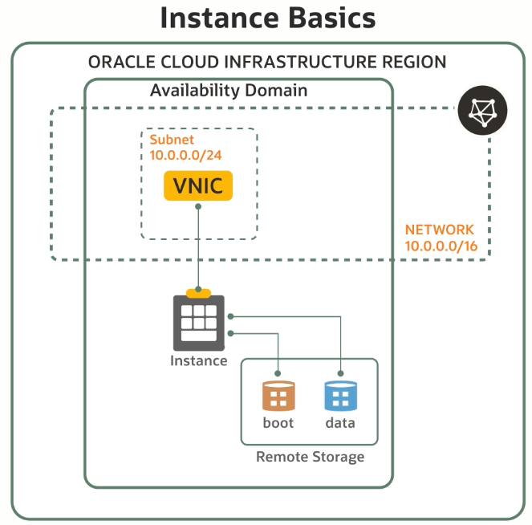

# Compute

## Introduction

* Virtual Machines
* Bare Metal Server
* Dedicated Host

Characteristics:

* Scalability
* Hig Performance
* Lower Princing

## Flexible Shapes

OCPU x Memory

Right Machine Type

* Flexible Shapes
* Sizing
    * Small
    * Medium
    * Large

Platforms

* AMD
* Intel
* Ampere (ARM)

Preemptible VM's

* Low Cost
* Short Lived VM's
* Batch Jobs
* Fault Tolerance Workload
* 50% Cheaper

## Instances

## Scale

Vertical Scalling

* Scale-up scale-down instance shape
* Downtime required
* Stop the instance before scale

Horizontal Scalling

* enable large-scale deployment of VM's
* Scale-out (+) scale-in (-)
* Match traffic demand, add or remove VM's
* Dimension and High Availability
* No extra Cost

First -> Runing Instance -> Generate Config
* OS Image
* Metadata
* Shape
* vNic
* Storage
* subnets

Second -> Config -> Create Instance Pool
* Manage all Together (start, stop, terminate)
* Different AD's

Third -> Instance Pool -> Scalling Rule
* Initial Size
* Maximum Size

eg. IF CPU or Memory > 70% ADD Instances

## OS Management

OSMS -> Helps Sysadmin automate instances management
(**NO Charge**)

* Automated Patch Management (Oracle Linux, Windows)
* Simplified Package Management
* Common Vulnerabilities and Exposure Lookup (Only Linux)

Automated Patch Management

* Fix Bug
* Improvement Performance
* Add Features

Simplified Package Management

* Installing
* Patching
* Removing

# Questions

You have a web application that receives 10X more traffic on the weekends than weekdays. You need to automatically match capacity to demand, keep the application always up and running, and save cost.

Which OCI compute feature can be used to meet these requirements?
- Parallel Scaling
- Manual Scaling
**Autoscaling** -> Autoscaling automatically scales up or down to meet the capacity requirements.
- Vertical Scaling

Which is NOT a valid compute shape option within the OCI compute service?
- Bare Metal
**Container Instance** -> You can run containers in OCI, but the service doesn’t offer a managed container instance.
- Dedicated Virtual Machine Host
- Virtual Machine

Which statement is true about OCI Compute Service?
- It doesn’t support Windows workloads.
- It provides a single size for different types of workloads.
- **It provides options to create Bare Metal or a Virtual Machine instance.** -> Oracle Cloud Infrastructure offers both Bare Metal and virtual machine instances.
- It is used only for running databases.

Which parameter is NOT modifiable?
- Number of OCPUs
- Amount of Memory
- Fault Domain
- **Primary Private IP address** -> Once allocated, the primary private IP for the instance is not editable.

Which is a feature of the OCI OS Management Service?
- Cost Management
- **Automated Patch Management** ->  OS management can be used for automating patches, simplifying package management and managing CVE (Common Vulnerability Exposure)
- Disk Encryption
- Autoscaling