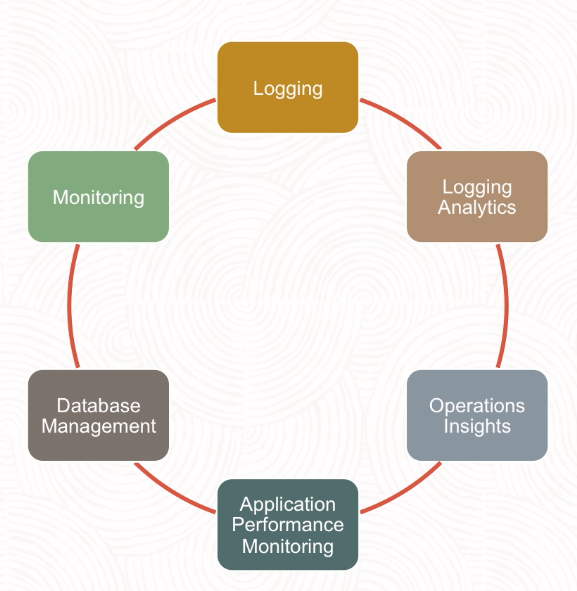

# Observability & Management

- Integrated Platform
- Multicloud, on-premises
- Cross-tier View
- Open Standards

## Monitoring

Metrics

- Measurement that let you monitor health, capacity and performance of your resources. Eg. CPU utilization

Metric = Namespace + Dimension + Metadata

Alarms

- Trigger alarm messages to configured destinations managed by the OCI Notification Service

## Logging

- Cloud Native
- Fully Managed
- Distributed Service

Simplifies

- Ingesting
- Managing
- Analyzing

- Centralized Log Management
- Rule-based Actions
- Built on open Standards

Logs Types:

- Audit Log
- Service Log
- Custom Log

## Logging Analytics

Logging

- Streaming Data
- Storing Data
- Archiving Data

- Dig into log
- Visualize to derive insights
- Take action on Heterogenous log format

- Navigate and understand machine data
- Perform Topology aware exploration
- Single View Multi-cloud, on premises

# Questions

Which OCI Monitoring service feature uses metrics for monitoring and consists of a trigger action and notification method?
- Queries
- Triggers
- Namespace
- **Alarms** -> Alarms use metrics for monitoring and consists of a trigger action and notification method.

Which services is NOT part of OCI Observability and Management services?
- Logging
- **OCI Registry** -> Monitoring, Logging and Logging Analytics are a part of Observability and Management Services.
- Monitoring
- Logging Analytics

Which OCI service will send you an alert for high CPU usage?
- Logging Analytics
- Events
- Logging
- **Monitoring** -> The Oracle Cloud Infrastructure Monitoring service enables you to actively and passively monitor your cloud resources using the Metrics and Alarms features.

Which types of logs is NOT supported by the OCI Logging service?
- Service Logs
- Custom Logs
- Audit Logs
- **Alert Logs** -> The OCI Logging service uses Audit Logs,Service logs and Custom logs.

Which statements is true with regard to the Oracle Cloud Infrastructure (OCI) Logging service?
- **It can analyze critical diagnostic information that describes how resources are performing.** -> The OCI Logging service can be used to enable,manage and search critical diagnostic information that describes how resources are performing.
- It can index, enrich, and aggregate log data from applications.
- It enables you to analyze cloud resources using custom metrics
- It enables you to monitor cloud resources using metrics and alarms.