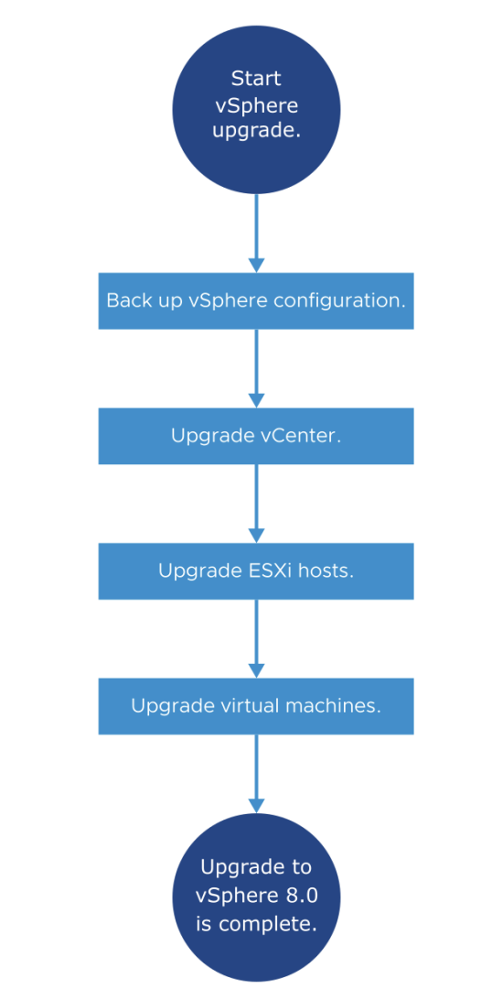

# Managing the vSphere Lifecycle

## 1. Managing the vCenter Life Cycle

### Learner Objectives

- Plan for vCenter updates and upgrades by generating interoperability reports
- Recognize how to update vCenter with the latest patches, updates, and upgrades

### About Upgrades, Updates, and Patches

vSphere products distinguish between upgrades, updates, and patches:

Upgrades:
- Major change to the software
- Either digit in the release number changes, for example, 6.7, 7.0, 8.0

Updates and Patches:
- Smaller changes to the software
- Update number is added to release number, for example, 7.0 Update 3

### Planning for vCenter Updates and Upgrades

To plan for vCenter updates and upgrades, you can produce interoperability reports about VMware products associated with vCenter.

You check VMware products against both the installed version of vCenter and the version to which you plan to
upgrade.

To generate interoperability reports, you must first join the VMware Customer Experience Improvement Program (CEIP).

### Generating the Interoperability Report

The Interoperability page on the vCenter instance's Monitor tab shows VMware products that are currently registered with vCenter and their compatibility with the current version of vCenter.

You can export report results in CSV format and use the report as a guide to prepare for an update.

### Updating and Patching vCenter

To manage the life cycle of vCenter, use the vCenter Management Interface to update and patch vCenter.

### Upgrading vCenter Server Appliance

You use the vCenter installer to upgrade vCenter Server Appliance to a newer version.

### Overview of the vSphere Upgrade Process

vSphere is a product with multiple components to upgrade.

Knowing the required sequence of tasks is vital for a successful vSphere upgrade.

## 2. Overview of vSphere Lifecycle Manager

### Learner Objectives

- Recognize features of vSphere Lifecycle Manager
- Import images into the vSphere Lifecycle Manager image depot
- Change the download source for patches and updates

### vSphere Lifecycle Manager

vSphere Lifecycle Manager enables centralized and simplified life cycle management for ESXi hosts in a cluster through the use of images.

vSphere Lifecycle Manager includes the following tasks:
- Managing VMware Tools and VM hardware upgrades
- Upgrading and patching ESXi hosts
- Installing and updating third-party software on ESXi hosts
- Installing and updating ESXi drivers and firmware
- Standardizing ESXi images across hosts in a cluster.

From the main menu, select Lifecycle Manager.

### Images

Managing clusters with images helps to standardize the
software running on your ESXi hosts.

An ESXi image consists of several elements:
- ESXi base image: An update that provides software fixes and enhancements
- Components: A logical grouping of one or more VIBs (vSphere Installation Bundles) that encapsulates functionality in ESXi
- Vendor add-ons: Sets of components that OEMs create and distribute
- Firmware and Drivers Add-On: Firmware and driver bundles that you can define for your cluster image
    - Requires the Hardware Support Manager plug-in for the desired server family

To maintain consistency, you apply a single ESXi image to all hosts in a cluster.

The vSphere Lifecycle Manager image depot represents all software available for consumption to vSphere Lifecycle Manager:
- The depot is located on the vCenter system.

In the Image Depot tab, you can view details about downloaded content:
- ESXi base images
- Vendor add-ons
- Third-party components

### Importing Content Into the Image Depot from Online Sources

At regular intervals, vSphere Lifecycle Manager downloads updates from configured download sources to the image depot.

Regardless of the download schedule, you can manually initiate synchronization between the image depot and the download sources.

From the ACTIONS drop-down menu in the Lifecycle Manager pane, select Sync Updates.

Select Settings > Patch Setup to view the default download sources.

From this pane, you can change the download source or add a URL to configure a custom download source.

You can also import updates from an offline bundle:
- From the Actions drop-down menu, select Import Updates.
- Enter a URL or browse for a ZIP file that contains the update (an ESXi image, vendor add-on or component).

## 3. Managing the Life Cycle of ESXi Hosts and Clusters

### Learner Objectives

- Activate vSphere Lifecycle Manager in a cluster and define a cluster image
- Validate ESXi host compliance against a cluster image
- Remediate ESXi hosts using vSphere Lifecycle Manager
- View recommended images for a cluster

### Overview of Managing Clusters with vSphere Lifecycle Manager

Over time, software updates become available in the image depot.
Using images from the image depot to update ESXi hosts is a multi-stage process:

1. Check the compliance of the ESXi hosts in the cluster against the image specification.
2. Run a remediation pre-check on the hosts in the cluster to ensure software and hardware
compatibility with the image.
3. Remediate the non-compliant ESXi hosts in the cluster.

After you define a cluster image, you can perform a compliance check to compare the cluster image with the software and firmware that runs on the ESXi hosts in the cluster.

To ensure that the cluster's health is good and that no problems occur during the remediation process of your ESXi hosts, you can perform a remediation pre-check.

### Staging the Cluster

Staging is the process during which vSphere Lifecycle Manager downloads patches and extensions from the image depot to the ESXi hosts.

During staging, the patches and extensions are not installed on the host.

Staging patches and extensions speeds up the remediation process, because the patches and extensions are already available locally on the hosts.

### Remediating a Cluster Against an Image

Remediation makes the selected hosts compliant with
the cluster image.

You can remediate the entire cluster or a single ESXi host, or simply pre-check hosts without updating them.

The goal is to make the entire cluster compliant with the image.

### Reviewing Remediation Impact

The Review Remediation Impact dialog box contains information about all changes that remediation performs on the hosts in the cluster.

vSphere Lifecycle Manager performs a remediation pre-check before each remediation.

If the pre-check is successful, vSphere Lifecycle Manager applies the image to the hosts.

### Parallel Remediation

You can configure vSphere Lifecycle Manager to perform parallel remediation in a cluster.

Parallel remediation remediates all hosts that are in maintenance mode in parallel instead of in sequence.

You can also specify the maximum number of concurrent remediations.

### vSphere Lifecycle Manager Integration with vSphere DRS

When performing remediation operations on a cluster that is configured for vSphere DRS, vSphere Lifecycle Manager automatically integrates with vSphere DRS:
- When vSphere Lifecycle Manager places hosts in the maintenance mode, vSphere DRS evacuates each host before the host is patched.
- When vSphere Lifecycle Manager attempts to place a host in the maintenance mode, certain checks are performed to verify that the ESXi host can enter the maintenance mode.
- The vSphere Client reports any configuration problems that might prevent an ESXi host from entering the maintenance mode.
- After a host is patched and rebooted, vSphere Lifecycle Manager exits the host from the maintenance mode and vSphere DRS migrates some VMs back to the host.

### Recommended Images

Using vSphere Lifecycle Manager, you can check for recommended images for a cluster that you manage with an image.

vSphere Lifecycle Manager checks for compatibility across the image components. The process verifies that the recommended image has no missing dependencies or conflicting components.

The recommended image is always in the major release series of the ESXi version of the image for the cluster.

After you start managing a cluster with an image, you can
edit the image: 
- Change the base image.
- Change, add, and remove components.

Before saving the image specification, you can validate it:
- Ensures completeness of the image
- Verifies that the image has no missing component dependencies
- Confirms that components do not conflict with one another

## 4. Managing the Life Cycle of VMware Tools and VM Hardware

### Learner Objectives

- Use vSphere Lifecycle Manager to upgrade VMware Tools and VM hardware

### Keeping VMware Tools Up To Date

VMware can provide a new release of VMware Tools with a release of ESXi.

New releases include:
- Bug fixes
- Security patches
- New driver support for ESXi enhancements
- Performance enhancements for virtual devices

Keeping VMware Tools up to date is an important part of ongoing data center maintenance.

### Keeping VM Hardware Up To Date

With almost every update of ESXi, VMware provides a new release of VM hardware.
As ESXi improves its hardware support, VMware often carries that support into its VMs.

New releases include:
- Greater configuration maximums
- New types of hardware (for example, vGPU, vNVMe, vSGX, vTPM, and so on)

Always upgrade VMware Tools before upgrading VM hardware.
Consider upgrading VM hardware only when new features are required.

Upgrade Available: Upgrade VM hardware to match the current version available for your ESXi hosts.

Up to Date: The version of VM hardware configured in the VM matches the latest available version for the ESXi host.

Plan the upgrade during your maintenance window.

## Key Points

- You can generate interoperability reports to verify that your vCenter system meets the minimum requirements for a successful upgrade. It also verifies the order in which vCenter and other products should be upgraded.
- vSphere Lifecycle Manager centralizes automated patch and version management for clusters, ESXi hosts, drivers and firmware, VM hardware, and VMware Tools.
- In vSphere Lifecycle Manager, you can manage ESXi hosts by using images.
- Keeping VMware Tools up to date is an important part of ongoing data center maintenance.
- Consider upgrading VM hardware only when new features are required.