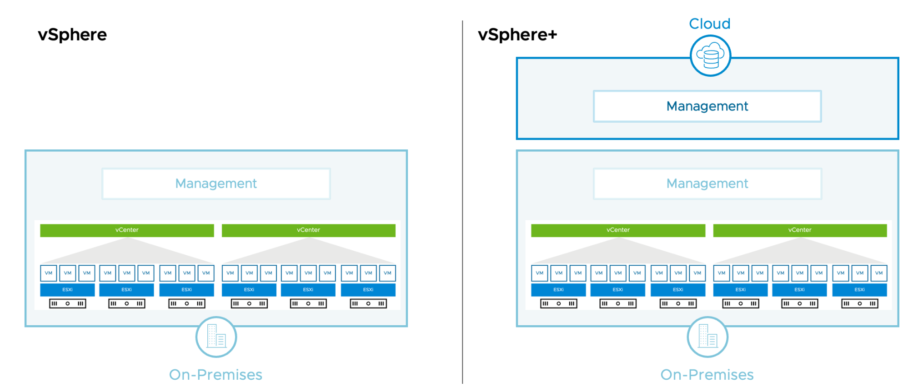

# 2 vSphere and Virtualization Overview

## 1. vSphere Virtualization Overview

Learner Objectives

- Explain basic virtualization concepts
- Describe vSphere
- Describe how vSphere fits in the software-defined data - center Describe vSphere+
- Recognize the user interfaces for accessing vSphere

### Terminology

| Term | Definition | Examples |
| ---- | ---------- | -------- |
| Operating system | Software designed to allocate physical resources to applications | Microsoft Windows, Linux | Software that runs on an operating system, consuming physical resources | Microsoft Office, Chrome |
| Application | Software that runs on an operating system, consuming physical resources | Microsoft Office, Chrome |
| Hypervisor | Specialized operating system designed to run ESXi, Workstation, VMs | ESXi, Workstation, Fusion |
| Virtual machine | Specialized application that abstracts hardware resources into software | - |
| Guest | The operating system that runs in a VM (also called the guest operating system) | Microsoft Windows |
| Host | Physical computer that provides resources to the ESXi hypervisor | - |
| vSphere | Server virtualization product of VMware that combines the ESXi hypervisor and the vCenter Server management platform | - |
| Cluster | Group of ESXi hosts whose resources are shared by VMs | - |
| vSphere vMotion | Feature that supports the migration of powered-on VMs from host to host without service interruption | - |
| vSphere HA | Cluster feature that protects against host hardware failures by restarting VMs on hosts that are running normally | - |
| vSphere DRS | Cluster feature that uses vSphere vMotion to place VMs on hosts and ensure that each VM receives the resources that it needs | - |

### Virtual Machines

A virtual machine (VM) is a software representation of a physical computer and its components.

The virtual machine includes the following components:
- Guest operating system
- VMware Tools
- Virtual resources, such as:
    - CPU and memory
    - Network adapters
    - Disks and controllers
    - GPUs

Benefits
- Easy to move or copy
- Independent of physical hardware because VMs are encapsulated into files
- Isolated from other VMs running on the same physical hardware
- Insulated from physical hardware changes

### vSphere
vSphere is the virtualization platform that includes two core administrative components for running virtual machines:

- ESXi: Hypervisor on which you run virtual machines
- vCenter: Central administration platform for ESXi hosts, virtual machines, storage, and networking

### Types of Virtualization

Virtualization is the process of creating a software-based representation of a physical unit, such as a server, desktop, network, or storage device.

- Server Virtualization
- Network Virtualization
- Storage Virtualization
- Desktop Virtualization

Virtualization Type 1 - 
Virtualization Type 2 - 

### vSphere+

- VMware vSphere+ is a subscription-based offering that brings the benefits of cloud to on- premises workloads.
- Consists of on-premises and cloud components that interact with each other.
- Lets you centrally manage your on-premises workloads from a cloud console, with access to cloud services.

### vSphere User Interfaces

- vSphere Client
- PowerCLI
- VMware Host Client
- vSphere ESXi Shell
- ESXCLI

## 2. vSphere Virtualization of Resources

Learner Objectives
Explain how ESXi interacts with resources:

- CPUs
- Memory 
- Networks
- Storage
- GPUs

### Virtual Machine: Guest and Consumer of ESXi Host

Any application in any supported OS can run in a VM (guest) and use CPU, memory, disk, and network from host- based resources.

### Physical and Virtual Architecture

Virtualization technology abstracts physical components to software components and provides solutions for many IT problems.

### Physical Resource Sharing

Multiple VMs, running on a physical host, share computing, memory, network, and storage resources of the host.

### CPU Virtualization

In a physical environment, the operating system assumes the ownership of all the physical CPUs in the system.
CPU virtualization emphasizes performance and runs directly on the available CPUs.

### Physical and Virtualized Host Memory Usage

In a physical environment, the operating system assumes the ownership of all the physical memory in the system.
Memory pages are allocated to virtual machines on first access.

### Physical and Virtual Networking

Virtual Ethernet adapters and virtual switches are key virtual networking components.

### Physical File Systems and Datastores

vSphere datastores provide a distributed storage architecture, where multiple ESXi hosts can read or write to the shared storage concurrently.

### GPU Virtualization

GPU graphics devices optimize complex graphics operations. These operations can run at high performance without overloading the CPU.

Virtual GPUs can be added to VMs for the following use cases:
- Rich 2D and 3D graphics
- VMware Horizon virtual desktops
- Graphics-intensive applications
- Scientific computation applications
- Artificial intelligence (AI) and machine learning (ML) workloads

## Key Points

- Virtual machines are hardware independent.
- vSphere consists of two core components, ESXi and vCenter Server.
- The ESXi hypervisor runs directly on the host.
- VMs share the physical resources of the ESXi host on which they reside.
- vSphere abstracts CPUs, GPUs, memory, storage, and networking for VM use.