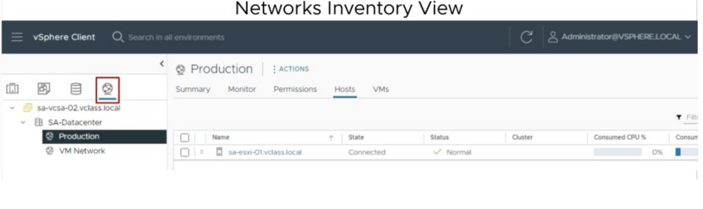

# 4 Deploying and Configuring vCenter

## 1. Centralized Management with vCenter

### Learner Objectives

- Describe the vCenter architecture
- Recognize ESXi hosts communication with vCenter
- Identify vCenter services

### vCenter Management Platform

vCenter acts as a central administration point for ESXi hosts and virtual machines. The ESXi hosts and virtual machines connected in a network:
- Directs the actions of VMs
and hosts
- Runs on a Linux-based
appliance

### vCenter Server Appliance

vCenter Server Appliance is a prepackaged Linux-based VM, optimized for running vCenter and associated services.

The vCenter Server Appliance package contains the following software:
- Photon OS
- PostgreSQL database
- vCenter services

vCenter services include:
- vCenter Server
- vSphere Client
- License service
- Content Library
- vSphere Lifecycle Manager

### vCenter Single Sign-On

vCenter Single Sign-On allows vSphere components to communicate with each other through a secure token mechanism.
vCenter Single Sign-On can authenticate users using built-in or external identity providers.

Built-in identity providers:
- By default, vCenter uses the vsphere.local domain as the identity source.
- You can configure vCenter to use Active Directory as the identity source using LDAP, LDAPS, OpenLDAP, or OpenLDAPS.

External identity provider using federated authentication:
- vSphere supports Active Directory Federation Services (AD FS).

With **Enhanced linked mode**, you can log in to the vSphere Client and manage the inventories of all the vCenter instances in the group:
- You can link up to 15 vCenter instances in one vCenter Single Sign-On domain.
- You can create an enhanced linked mode group during the deployment of vCenter Server Appliance.

### ESXi and vCenter Communication

The vSphere Client is the primary method to manage ESXi hosts. vSphere Client communicates directly with vCenter.
If vCenter is not available, you use VMware Host Client to communicate directly with the ESXi host.

### vCenter Scalability

| Metric | vCenter 8.0 |
| --- | --- |
| Hosts per vCenter instance | 2.500 |
| Powered-on VMs per vCenter instance | 40.000 |
| Registered VMs per vCenter instance | 45.000 |
| **Hosts per Cluster** | **96** |
| VMs per Cluster | 8.000 |

## 2. Deploying vCenter Server Appliance

Before deploying vCenter Server Appliance, you must complete several tasks:
- Verify that all vCenter Server Appliance system requirements are met.
- Get the fully qualified domain name (FQDN) or the static IP of the host machine on which you install vCenter Server Appliance.
- Get FQDN and IP address to assign to vCenter Server Appliance.
- Ensure that date and time on all VMs in the vSphere network are synchronized.

The vCenter Server Appliance installation is a two-stage process:
- Stage 1: Deployment of OVF
- Stage 2: Configuration

The deployment can be fully automated by using JSON templates with the CLI installer on Windows, Linux, or macOS.

**Stage 1** begins with the UI phase:
- Accept the EULA.
- Connect to the target ESXi host or vCenter system.
- Define the vCenter Server Appliance name and root password.
- Select compute size, storage size, and datastore location (thin disk).
- Define networking settings.

Stage 1 continues with the deployment phase:
- OVF is deployed to the ESXi host.
- Disks and networking are configured.

**Stage 2** is the configuration phase:
- Configure time synchronization mode and SSH access.
- Create a vCenter Single Sign-On domain or join an existing SSO domain.
- Join the Customer Experience Improvement Program (CEIP).

Use the vSphere Client to log in and manage your vCenter inventory: **https://<vCenter_FQDN_or_IP_address>/ui**.

Using the vCenter Management Interface in **https://<vCenter_FQDN_or_IP_address>:5480**, you can configure and monitor your vCenter instance.

Tasks include:
- Monitoring resource use by the appliance
- Backing up the appliance
- Monitoring vCenter services
- Adding additional network adapters

## 3. vSphere Licenses

| vSphere Essential Kit | vSphere Essential Plus Kit | vSphere Standard | vSphere Enterprise Plus |
| --- | --- | --- | --- |
| For small businesses (up to three hosts with up to two CPUs each) | For small businesses (up to three hosts with up to two CPUs each) | Entry-level solution for basic server consolidation | Full range of features for transforming your data center into a simplified cloud infrastructure | 
| vCenter and ESXi | vCenter and ESXi | vCenter and ESXi | vCenter and ESXi | 
| | vSphere vMotion, vSphere Storage vMotion, vSphere HA, vSphere Data Protection, vSphere Replication | vSphere vMotion, vSphere Storage vMotion, vSphere HA, vSphere Replication | vSphere vMotion, vSphere Storage vMotion, vSphere HA, vSphere Trust Authority, VM encryption, vSphere Replication | 

**Use the vSphere Client to add vSphere licenses to vCenter and assign a license to vCenter.**

## 4. Managing vCenter Inventory

Host and cluster objects appear in one view, and VM and template objects are displayed in another view.

The storage inventory view shows all the details for datastores in the data center.

The networking inventory view shows all the port groups on standard switches and distributed switches.

- A virtual data center is a logical organization of all the inventory objects.
- You can create multiple data centers to organize sets of environments.
- Each data center has its own hosts, VMs, templates, datastores, and networks.

You can place Objects in a data center in folders. You can create folders and subfolders to better organize systems.

- You can use tags to attach metadata to objects in the vCenter inventory. Tags help make these objects more sortable.
- You can associate a set of objects of the same type by searching for objects by a given tag.
- You can use tags to group and manage VMs, clusters, and datastores.

## 5. vCenter Roles and Permissions

The following concepts are important:
- Privilege: An action that can be performed
- Role: A set of privileges
- Object: The target of the action
- User or group: Indication of who can perform the action
- Permission: Gives one user or group a role (set of privileges) for the selected object

To assign a permission:
1. Select an object
2. Select a Domain
3. Select a User/Group
4. Select a Role
5. Propagate the permission to
the child objects

The Roles pane shows which users are assigned the selected role on a particular object.

### Roles 

Privileges are grouped into roles:
- A privilege allows access to a specific task and is grouped with other privileges related to it.
- Roles allow users to perform tasks.

vCenter provides a few system roles, which you cannot modify.

### Objects

Objects are entities on which actions are performed. Objects include data centers, folders, clusters, hosts, datastores, networks, and virtual machines.
All objects have a Permissions tab. The Permissions tab shows which user or group and role are associated with the selected object.

### Creating a Role

Create roles with only the necessary privileges.

For example, you can create a Provision VMs role that allows a user to deploy VMs from a template.

Use folders to contain the scope of permissions. For instance, you can assign the Provision VMs role to user nancy@company.com and apply it to the Production VMs folder.

Provision VMs role:

- Datastore > Allocate space
- Resource > Assign virtual machine to resource pool
- Virtual Machine >
    - Edit inventory > Create from existing
    - Interaction > Power On
- Provisioning > 
    - Allow read-only disk access
    - Customize guest
    - deploy template
    - Read Customization specifications

### Global Permissions

Global permissions support assigning privileges across solutions from the global root object:
- Span solutions, such as vRealize Orchestrator, and multiple vCenter instances
- Give a user or group privileges for all objects in all vCenter hierarchies

## 6. Monitoring vCenter Events

### vSphere Tasks

Every action that you perform in vSphere as a part of your day-to-day operations is called a task, for example:
- Powering on a virtual machine
- Updating the network configuration
- Modifying the configuration of hosts and virtual machines

### vSphere Events

vSphere events are records of user actions or system actions that occur on objects in the vCenter inventory:
- User-action information includes the user’s account and specific event details.
- Event details are reported, such as the event's date and time, type, description, and the
object on which the event occurred.
- Events and alarms are displayed to alert the user to changes in the vCenter service health
or when a service fails.

The vCenter Tasks and Events panes provide an audit trail, maintaining a 30-day history, by default.

### vCenter Log

vCenter services create their own log files, which can be used for troubleshooting purposes.
You can set log levels to control the quantity and type of information stored by vCenter.

Examples of when to set log levels:
- When troubleshooting complex issues, set the log level to verbose or trivia.
- For controlling the amount of information being stored in the log files.

| Option | Description |
| --- | --- |
| None | Turns off logging |
| Error (errors only) | Displays only error log entries |
| Warning (errors and warnings) | Displays warning and error log entries |
| Info (normal logging) | Displays information, error, and warning log entries |
| Verbose | Displays information, error, warning, and verbose log entries |
| Trivia (extended verbose) | Displays information, error, warning, verbose, and trivia log entries |

You can configure the amount of log information detail that vCenter collects in log files:
- Edit the log levels in the vSphere Client.
- More verbose logging requires more space on your vCenter system.

vCenter can stream its log information to a remote Syslog server.
You can activate this feature in the vCenter Management Interface (VAMI).

For ESXi hosts, specify the remote Syslog server name in the Advanced System Settings pane in the vSphere Client.
You can further analyze ESXi host log files with log analysis products, such as vRealize Log Insight.

## Key Points

- vCenter Server Appliance uses the Photon operating system and the PostgreSQL database.
- You can use the vCenter Management Interface to manage vCenter, including vCenter networking and vCenter services.
- You use the vSphere Client to connect to vCenter instances and manage vCenter inventory objects.
- A permission, defined in vCenter, gives one user or group a role (set of privileges) for a selected object.
- Global permission allows access to all vCenter objects, including content libraries, vCenter instances, and tags.
- You can control the vCenter logging level. Changing the logging level affects the vCenter's filesystem usage.