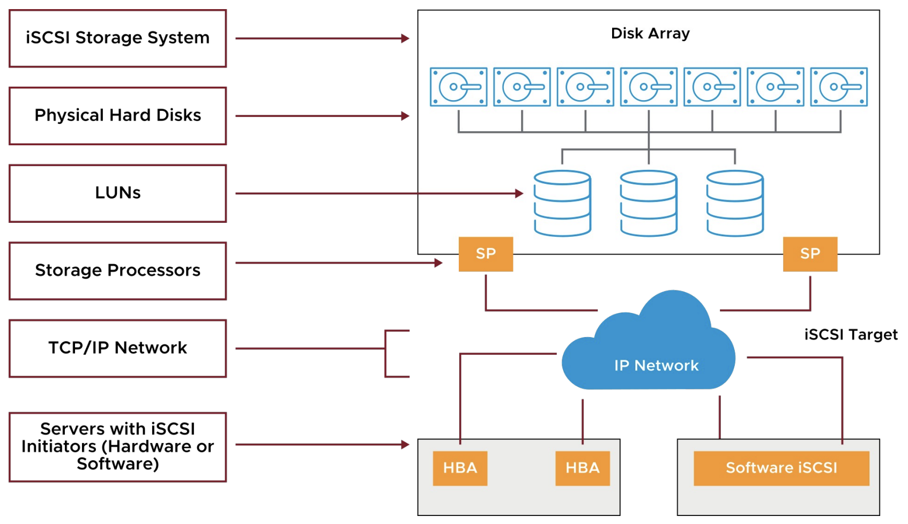

# 6 Configuring vSphere Storage

## 1. Storage Concepts

### Learner Objectives

- Recognize vSphere storage technologies
- Identify types of datastores
- Recognize storage device naming conventions

### Datastores

A datastore is a logical storage unit that can use space on one or more physical storage devices.

Datastores are used to hold data such as VMs, VM templates, and ISO images.

vSphere supports the following types of datastores:
- VMFS
- NFS
- vSAN
- vSphere Virtual Volumes

vSphere datastores store and access data as blocks or files:

Block-backed storage:
- Stores data as blocks (a sequence of bytes)
- Used on local storage
- Used on Storage Area Networks (SANs) and accessed through either iSCSI or Fibre Channel
- Used by VMFS, vSAN, and vSphere Virtual Volumes datastores

File-backed storage:
- Stores data hierarchically in files and folders
- Used on network-attached storage (NAS)
- Used by NFS and vSphere Virtual Volumes datastores

Depending on the datastore type, contents can be stored in the form of files or objects.

File-based datastores:
- A VM consists of a set of files.
- Each VM has its own directory.
- VMFS and NFS datastores hold files.

Object-based datastores:
- A VM consists of a set of data containers called objects.
- vSAN and vSphere Virtual Volumes datastores hold objects.

| Datastore Type | Datastore Access Method | Datastore Contents |
| --- | --- | --- |
| VMFS | Block access | Files |
| NFS | File access | Files |
| vSAN | Block access | Objects |
| vSphere Virtual Volumes | Block access or File access | Objects |

### Device Naming Conventions

Storage devices are identified in several ways:
- Runtime name: Uses the vmhbaN:C:T:L convention. This name is not persistent through reboots.
- Target: Identifies the target address and port.
- LUN: A unique identifier designated to individual or collections of storage devices.

### Storage Protocol Overview

| Datastore Type | Storage Protocol | Boot from SAN Support | vSphere vMotion Support | vSphere HA Support | vSphere DRS Support |
| --- | --- | :---: | --- | --- | --- |
| VMFS | Fibre Channel | Yes | Yes | Yes | Yes |
| VMFS | FCoE | Yes | Yes | Yes | Yes |
| VMFS | iSCSI | Yes | Yes | Yes | Yes |
| VMFS | iSER/NVMe-oF (RDMA) | No | Yes | Yes | Yes |
| VMFS | DAS (SAS, SATA, NVMe) | N/A | Yes* | No | No |
| NFS | NFS | No | Yes | Yes | Yes |
| vSphere Virtual Volumes | FC/Ethernet (iSCSI, NFS) | No | Yes | Yes | Yes |
| vSAN Datastore | vSAN | No | Yes | Yes | Yes |

### vSphere Virtual Machine File System

ESXi hosts support vSphere Virtual Machine File System (VMFS) VMFS5 and VMFS6:

Features supported by both VMFS5 and VMFS6:
– Concurrent access to shared storage
– Dynamic expansion
– On-disk locking

Features supported by VMFS6:
– 4K native storage devices
– Automatic space reclamation
– 128 hosts per datastore

### NFS

A Network File System (NFS) is a file-sharing protocol that ESXi hosts use to communicate with a network-attached storage (NAS) device.

NFS supports NFS 3 and 4.1 over TCP/IP.

### vSAN

vSAN is a hypervisor-converged, software-defined storage solution for virtual environments that does not use traditional external storage.

By clustering host-attached solid-state drives (SSDs) and hard disk drives (HDDs), vSAN creates an aggregated datastore that is accessible to all the ESXi hosts in the vSAN cluster.

### vSphere Virtual Volumes

vSphere Virtual Volumes provides several functionalities:
- Native representation of VMDKs on SAN/NAS: No LUNs or volume management
- Works with existing SAN/NAS systems
- A new control path for data operations at the VM and VMDK level
- Snapshots, replications, and other operations at the VM level on external storage
- Automates control of per-VM service levels by using storage policies
- Standard access to storage with the vSphere API for Storage Awareness protocol endpoint
- Storage containers that span an entire array

### Raw Device Mapping

Although not a datastore, raw device mapping (RDM) gives a VM direct access to a physical LUN.
The mapping file (-rdm.vmdk) that points a VM to a LUN must be stored on a VMFS datastore.

### Physical Storage Considerations

Before implementing your vSphere environment, discuss the storage needs with your storage administration team. Consider the following factors:
- LUN sizes
- I/O bandwidth required by your applications
- I/O requests per second that a LUN is capable of
- Disk cache parameters
- Zoning and masking
- Multipathing setting for your storage arrays (active-active or active-passive)
- Export properties for NFS datastores

## 2. Fibre Channel Storage

### Learner Objectives

- Describe uses of Fibre Channel with ESXi
- Describe Fibre Channel components and addressing
- Explain how multipathing with Fibre Channel works

### Fibre Channel

Fibre Channel is a protocol used for accessing
storage devices across a network.

A Fibre Channel SAN is a specialized high-speed network that connects your hosts to high-performance storage devices.

The network uses the Fibre Channel protocol to transport SCSI traffic from VMs to the Fibre Channel SAN devices.

ESXi supports:
- 32 Gbps Fibre Channel
- Fibre Channel over Ethernet (FCoE)

A Fibre Channel SAN consists of one or more servers that are attached to a storage array using one or more Fibre Channel switches.

### Fibre Channel Addressing and Access Control

### Multipathing with Fibre Channel

Multipathing is having more than one path from a host to a LUN.

Multipathing provides the following functions:
- Continued access to SAN LUNs if hardware fails
-  Load balancing

## 3. iSCSI Storage

### Learner Objectives

- Describe iSCSI components and addressing
- Configure iSCSI initiators

### iSCSI Components

An iSCSI SAN consists of an iSCSI storage system, which contains LUNs and storage processors.
Communication between the host and storage array occurs over an Ethernet network.

### iSCSI Addressing

### iSCSI Adapters

You must set up software or hardware iSCSI adapters before an ESXi host can work with iSCSI storage. To access iSCSI targets, your host uses iSCSI initiators.

### ESXi Network Configuration for Software iSCSI

A VMkernel port must be created before enabling the software iSCSI initiator.

To optimize your vSphere networking setup, you separate iSCSI networks from NAS and NFS networks:
- Physical separation is preferred
- If physical separation is not possible, use VLANs

To add the software iSCSI adapter:
1. Select the host and click the Configure tab.
2. Select Storage Adapters and click ADD SOFTWARE ADAPTER > Add iSCSI adapter.

The software iSCSI adapter (vmhba65) appears in the list.

### Discovering iSCSI Targets

The iSCSI adapter discovers storage resources on the network and determines which resources are available for access.

An ESXi host supports the following discovery methods:
- Static
- Dynamic or SendTargets

The SendTargets response returns the IQN and all available IP addresses.

### iSCSI Security: CHAP

iSCSI initiators use CHAP for authentication purposes. By default, CHAP is not configured.

ESXi supports two types of CHAP authentication:
- Unidirectional
- Bidirectional

ESXi also supports per-target CHAP authentication.

### Multipathing with Software iSCSI

Software iSCSI uses multiple NICs:
- Each NIC is connected to a separate VMkernel port.
- Each VMkernel port binds with the iSCSI initiator.

### Multipathing with Dependent Hardware iSCSI

Dependent hardware iSCSI uses multiple NICs and iSCSI HBAs:
- Each NIC is connected to a separate VMkernel port.
- Each VMkernel port binds with the iSCSI initiator.

### Multipathing with Independent Hardware iSCSI

Independent hardware iSCSI uses two or more hardware iSCSI adapters.

## 4. VMFS Datastores

### Learner Objectives

- Create a VMFS datastore
- Increase the size of a VMFS datastore
- Delete a VMFS datastore

### VMFS Datastores

VMFS is a high-performance, cluster file system that serves as a repository for files such as VM files, VM templates and ISO images.

A VMFS datastore is optimized for storing and accessing large files, such as virtual disks and memory images of suspended VMs.

A VMFS datastore can have a maximum volume size of 64 TB.

You can create VMFS datastores on any SCSI-based storage devices that the host discovers, including Fibre Channel, iSCSI, and local storage devices.

### Increasing the Size of VMFS Datastores

Increase a VMFS datastore’s size to give it more space or to possibly improve performance.

In general, before changing your storage allocation:
- Perform a rescan to ensure that all hosts see the most current storage.
- Record the unique identifier of the volume that you want to expand.

To dynamically increase the size of a VMFS datastore, use one of the following methods:
- Add an extent (LUN).
- Expand the datastore within its extent.

**You can expand, but you can't shrink a VMFS datastore**

### Datastore Maintenance Mode

Before taking a datastore out of service, place the datastore in maintenance mode.

Before placing a datastore in maintenance mode, you must first move all VMs (powered on and powered off) and templates to a different datastore.

The datastore enters maintenance mode after all VMs and templates are moved off the datastore.

### Deleting or Unmounting a VMFS Datastore

An unmounted datastore remains intact, but cannot be seen from the hosts that you specify.

It continues to appear on other hosts, where it remains mounted.

A deleted datastore is destroyed and disappears from all hosts that have access to it.

The deleted datastore permanently removes all files on the datastore.

### Multipathing Algorithms

Arrays provide active-active and active-passive storage processors. Multipathing algorithms interact with these storage arrays:

- vSphere offers native path selection, load-balancing, and failover mechanisms.

- Third-party vendors can create software for ESXi hosts to properly interact with the storage arrays.

### Configuring Storage Load Balancing

Path selection policies provide:
- Scalability:
    - Round Robin
- Availability:
    - Most Recently Used
    - Fixed

## 5. NFS Datastores

### Learner Objectives

- Identify NFS components
- Recognize the differences between NFS 3 and NFS 4.1
- Configure and manage NFS datastores

### NFS Components

An NFS file system is on a NAS device that is called the NFS server.

### NFS v3 and NFS v4.1

An NFS datastore can be created as either NFS 3 or NFS 4.1.

| NFS 3 | NFS 4.1 |
| ----- | ------- |
| ESXi managed multipathing | Native multipathing and session trunking |
| AUTH_SYS (root) authentication | Optional Kerberos authentication |
| VMware proprietary client-side file locking | Server-side file locking |
| Client-side error tracking | Server-side error tracking |

vSphere supports NFS 4.1 to overcome many limitations when using NFS 3. Both NFS 3 and

NFS 4.1 shares can be used, but you must consider important constraints when designing a vSphere environment in which both versions are used.

| vSphere Technology | NFS 3 | NFS 4.1 |
| ------------------ | ----- | ------- |
| vSphere vMotion and vSphere Storage vMotion | Yes | Yes |
| vSphere HA and vSphere Fault Tolerance | Yes | Yes |
| vSphere DRS and vSphere DPM | Yes | Yes |
| Stateless ESXi and Host Profiles | Yes | Yes |
| vSphere Storage DRS and Storage I/O Control | Yes | No |
| Site Recovery Manager | Yes | Partial |
| vSphere Virtual Volumes and vSphere Replication | Yes | Yes |
| vRealize Operations Manager | Yes | Yes |
| Host Profiles | Yes | Yes |

### Configuring NFS Datastores

To configure an NFS datastore:
1. Create a VMkernel port:
- For better performance and security, separate your NFS network from the iSCSI network.
2. Create the NFS datastore by providing the following information:
- NFS version: 3 or 4.1
- Datastore name
- NFS server names or IP addresses
- Folder on the NFS server, for example, /templates or /nfs_share
- Whether to mount the NFS file system as read only
- Hosts that mount the datastore
- Authentication parameters

### Unmounting an NFS Datastore

Unmounting an NFS datastore causes the files on the datastore to become inaccessible to the selected ESXi hosts.

Before unmounting an NFS datastore, you must power off all VMs whose disks reside on the datastore.

### Multipathing and NFS Storage

For a highly available NAS architecture, configure NFS multipathing to avoid single points of failure.

Example of a multipathing configuration:
- Configure one VMkernel port.
- Attach NICs to the same physical switch to configure NIC teaming.
- Configure the NFS server with multiple IP addresses (same subnet is OK).
- To better use multiple links, configure NIC teams with the IP hash load-balancing policy.

NFS 4.1 supports native multipathing and session trunking.

To configure multipathing, enter multiple server IP addresses when configuring the datastore.

## Key Points

- ESXi hosts support various storage technologies: Direct-attached storage, Fibre Channel, FCoE, iSCSI, and NAS.
- VMFS and NFS datastores hold VM files.
- vSAN and vSphere Virtual Volumes hold VM objects.
- With port binding, each VMkernel port that is connected to a separate NIC becomes a different path that the iSCSI storage can use.
- Shared storage is integral to vSphere features such as vSphere vMotion, vSphere HA, and vSphere DRS.