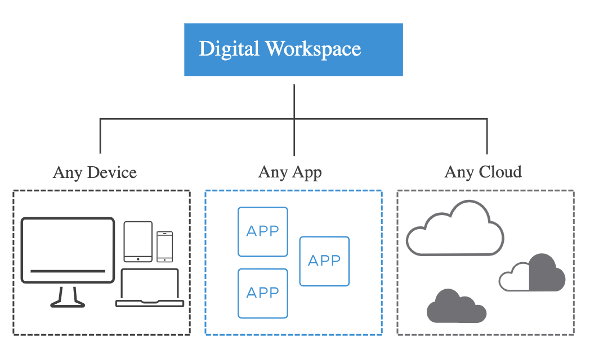

# 1. Introduction to Software-Defined Data Center

Learner Objectives
- Identify types of virtualization used in a software-defined data center
- Recognize the components of an SDDC
- Describe the relationship between vSphere, the SDDC, and cloud computing

## Data Center Virtualization

### Extending Virtualization to All Resources

A data center is a centralized physical facility that contains corporate computers, network, storage, and other IT equipment that support business operations. A traditional, on-premises, hardware-defined data center is limited by the physical attributes of the available resources.

If the demands placed on the infrastructure exceed its capacity, problems occur. Performance might be negatively affected, and the whole network can go down.

Virtualization software can transform a traditional data center into a software-defined data center (SDDC). In an SDDC, virtualization extends to all resources, including CPU, networking, storage, and security. And the data center is no longer limited by its physical dimensions.

### Types of Virtualization

An SDDC uses different types of virtualization to deliver its resources as services:
- Server virtualization divides a physical server into multiple, unique, and isolated virtual servers.
- Network virtualization replicates a physical network in software. Applications run on the virtual network exactly as if on a physical network.
- Storage virtualization abstracts and pools multiple storage devices, so that they appear as a single virtual storage device.
- Desktop virtualization abstracts desktop services and applications from the underlying host system so that users can access them without having to interact with the physical host computer.

#### Server Virtualization

In server virtualization, each virtual server or virtual machine (VM) runs its own operating system, independently of other VMs.

Each VM can access the underlying computing resources of the physical server.

Server virtualization solution: vSphere
vSphere abstracts the physical resources of a host computer and makes them available to multiple guest virtual machines.

#### Network Virtualization

Network virtualization presents logical networking devices and services such as ports, switches, routers, firewalls, load balancers, and VPNs to connected VMs.

Network virtualization solution: NSX Data Center
NSX Data Center delivers networking and security in one software application, abstracted from the underlying physical infrastructure.

#### Storage Virtualization

By virtualizing storage, you separate the underlying hardware infrastructure from software-based storage management, providing more flexibility and scalability to your storage resources.

Storage virtualization solution: vSAN
vSAN provides storage virtualization at the host level and logically abstracts the physical storage layer for VMs.

#### Desktop Virtualization

By deploying desktops and applications as a managed service, you can respond on demand to the changing needs of your organization, using any device and any cloud.

Desktop virtualization solution: VMware Horizon
VMware Horizon simplifies the management and delivery of virtual desktops and apps through a single cloud platform to end users.

### vSphere and the SDDC

By using server virtualization, data centers can become fully virtualized software-defined data centers with virtual networking, storage, and security. How does this transformation occur?

vSphere is the virtualization platform that transforms traditional data centers into SDDCs by performing the following functions:
- Virtualization and pooling of resources such as CPU, storage, and networking
- Management of aggregated resources as unified computing infrastructures
- Provision of tools to administer the data centers

#### Components of a Standard SDDC

##### Service Management and Automation

Managing IT in any business requires a system that can administer the entire portfolio of services and operations:
- Keeping and managing the records of the service consumption
- Analyzing the data of events and trends to support better decision making
- Monitoring applications to ensure their availability and performance
- Alerting about system problems to resolve them promptly

The IT service manager typically uses a single software application to configure and automate the provision of services for different users.

##### Cloud Management Layer

The cloud management layer is the top layer of the stack. The consumption of cloud services occurs at this layer.

Some of the most common cloud services include access to the virtualized compute, network, and storage resources, and the subscription to software applications.

The cloud manager configures a set of privileges, pricing, terms, and conditions for the use of cloud services. This layer calls for resources and orchestrates the actions of the lower layers, based on the parameters predefined by the cloud manager.

##### Virtual Infrastructure Layer

The virtual infrastructure layer, which is the heart of the SDDC, abstracts the compute, networking, and storage resources from the physical layer to manage them as virtual pools of resources.

This layer presents the virtualized resources to the cloud management layer so that the cloud consumers can access the resources.

The virtual infrastructure layer establishes a virtualized environment that integrates with the solutions in all other layers of the SDDC.

##### Physical Layer

The lowest layer of the SDDC solution is the physical layer. It consists of the compute, network, and storage infrastructure components, which are the hardware that resides in the data center.

When setting up the physical infrastructure, you can use the VMware Compatibility Guide, which shows all the types and brands of supported hardware.

The infrastructure administrator organizes and manages the hardware by establishing a set of rules about how the resources function, who can access them, and by which methods.

##### Business Continuity

The business continuity layer includes solutions for data protection and disaster recovery of critical management components of the SDDC.

If a system component fails, redundant components immediately take over operations so that services are not interrupted. If a disaster occurs, the backup components in a remote location are used to resume operations promptly.

A business continuity plan must provide guidance on how to operate the backup and restore functions for the SDDC and prevent the permanent loss of business critical data.

##### Security

All systems must be secure by design. A secure design reduces the risk of data breaches, loss of data, and cyber attacks, for example.

The security layer controls the operations that make an SDDC resilient to both internal and external threats.

#### Question: vSphere and the SDDC

Drawing on what you have learned so far, which statements best describe the role of vSphere in the SDDC?

- [ ] Delivers networking and security entirely in one software application
- [x] Controls access to the underlying physical infrastructure
- [x] Pools, controls, and allocates resources that are consumed through the cloud management layer
- [ ] Simplifies the management and delivery of virtual desktops and applications

### vSphere and Cloud Computing

In an SDDC, the infrastructure is virtualized, and software automates the control of the data center. This virtual infrastructure and software automation are the foundation for cloud computing. But how does the SDDC use cloud computing technology?

Cloud computing is the delivery of on-demand computing services. In other words, your software runs on the SDDC of a cloud services provider.
Cloud services can be managed and delivered in different ways:

- Private cloud: You host and manage the underlying infrastructure of your SDDC on-premises
(On-premises means on the physical resources owned and managed by your company).

- Public cloud: A third party (You access the cloud services over the Internet) owns and manages the underlying infrastructure of your SDDC.
- Hybrid cloud: Some resources are hosted on-premises and some in the public cloud.

#### vSphere and VMware Cloud Foundation

VMware Cloud Foundation integrates vSphere, NSX Data Center, and vSAN to provide a unified SDDC platform for the private and public cloud:

- vSphere, the foundation technology, virtualizes the compute resources of the data center.
- NSX Data Center manages the virtualization of networking.
- vSAN manages the virtualization of storage resources.

## Knowledge Check

Questions:

Which VMware solution makes server virtualization possible?

- [ ] Horizon
- [x] vSphere
- [ ] NSX Data Center
- [ ] vSAN

In which layer of the SDDC does vSphere fit?

- [ ] Business continuity
- [x] Virtual infrastructure
- [ ] Service management
- [ ] Cloud management

Which type of resource does vSphere virtualize in the cloud infrastructure?

- [ ] Networking
- [ ] Storage
- [x] Compute