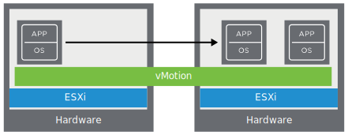

# 3. vSphere Components and Features

Learner Objectives
- Identify the functions of the components in a vSphere environment
- Describe the vSphere features and their benefits

## vSphere Components and Features

### vSphere Components

You can use the vSphere platform and tools to the manage physical resources, such as CPU, storage, and networking, which support the virtual infrastructure.

This virtual infrastructure includes the following core components for running virtual machines:
- VMware ESXi™: You create and run VMs on this hypervisorThe software that extracts the computer's hardware and presents it as virtual hardware to VMs is called hypervisor..
- VMware vCenter Server®: You use this service to centrally administer the connected ESXi hosts.

In addition to these two core components, the vSphere virtual infrastructure includes several components that perform different functions.

#### Role of vSphere Components

##### vSphere Client

The vSphere Client is a graphical interface for administering vCenter Server. It is the visual part of the software where you view and interact with the buttons and controls.

Through the vSphere Client, you connect to vCenter Server to manage ESXi hosts and other components of the vSphere environment.

You can use the vSphere Client from a browser on any computer that is connected to the same network as vCenter Server.

##### vCenter Server

The vCenter Server software component manages multiple ESXi hosts and their physical resources. vCenter Server also manages virtual machines, virtual networks, and storage.

vCenter Server is deployed as a virtual appliance
(*A virtual appliance is a type of VM that is preconfigured with an OS and an application that performs a specific task.*) that runs on an ESXi host. vCenter Server is preconfigured to manage the entire vSphere environment.

##### Virtual Machine

A virtual machine or VM is a software representation of a physical computer and its components.

Like a physical computer, each VM runs an operating system and one or more applications.

##### ESXi

The ESXi software runs on a host. The ESXi host creates and runs VMs that are independent of one another.

When you install the ESXi software on a server, ESXi controls the underlying resources of the server and divides the hardware for running multiple guest operating systems.

You can run an individual ESXi host, which is also called a standalone host. You can also use vCenter Server to collectively manage several ESXi hosts.

##### vSphere network

The ESXi software runs on a host. The ESXi host creates and runs VMs that are independent of one another.

When you install the ESXi software on a server, ESXi controls the underlying resources of the server and divides the hardware for running multiple guest operating systems.

You can run an individual ESXi host, which is also called a standalone host. You can also use vCenter Server to collectively manage several ESXi hosts.

##### Storage Devices

vSphere uses different types of physical storage devices to present to VMs as the virtualized storage hardware:
- Storage devices that are connected through a network
- Storage devices that are directly attached to ESXi hosts

### vSphere Features

Migrating from a physical infrastructure to a virtual infrastructure provides numerous benefits. After migrating to vSphere, several key features are available to you.

#### vSphere vMotion

Virtual machines can be moved or migrated from one host to another host with zero downtime by using the VMware vSphere® vMotion® feature. If a physical host must be shut down for maintenance or upgrade, all virtual machines running on that host can be migrated to other hosts. This method ensures that no downtime occurs for maintenance operations.

#### vSphere HA

When you use the VMware vSphere® High Availability feature, a physical server failure does not stop your business. Virtual machines on the failed host are automatically started on other hosts. This feature minimizes the downtime, which is experienced by a physical server failure, to 1 or 2 minutes.

#### vSphere DRS

Virtual servers that require heavy server resources can be moved automatically to hosts that have available capacity by using the VMware vSphere® Distributed Resource Scheduler™ feature. This feature ensures that all virtual servers can work at 100 percent capacity and access the resources that they need despite the loads of other virtual machines.

## Knowledge Check

Which components are core to running a vSphere infrastructure?

- [ ] vSphere networking
- [x] vCenter Server
- [ ] vSphere storage
- [ ] Virtual machines
- [x] ESXi