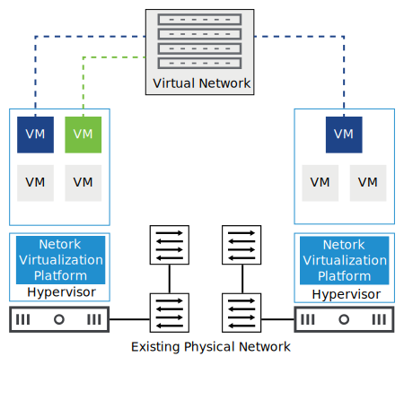

# 4. Network Virtualization

Learner Objectives
- Describe the importance of network virtualization for the IT industry
- Describe network virtualization and its implementation
- Identify the benefits of network virtualization

## Network Virtualization

### About Network Virtualization

Network virtualization is the separation
(*In the world of information technology, the separation of physical items into virtual components is called abstraction.*) of network services that were traditionally delivered in hardware into software. Network virtualization takes the capabilities of traditional hardware network devices and recreates them in software. Because these network services are now software-based, they are independent and separated from the hardware that they run on.

Network virtualization transforms one physical network to multiple virtual (software-based) networks or combines multiple physical networks into one virtual network. Virtual LAN (VLAN) is an example of network virtualization.

The network virtualization software can create separate virtual networks over the same physical network infrastructure or network fabric.

Using virtualization, you can move the control of the data center from hardware to software. With software-defined data centers (SDDC), the data center infrastructure elements, such as compute, storage, and networking, are virtualized and grouped into pools of resources and automatically deployed, with little or no human involvement.

With network virtualization enabling the SDDC, you do not need to spend days or weeks provisioning the infrastructure to support a new application.

This approach converts the networks from static, inflexible, and inefficient to dynamic, agile, and optimized.

### Implementing Network Virtualization

Server virtualization uses virtual machines to run multiple applications on the same hardware. Network virtualization uses virtual networks to provide network and security services to the virtualized applications.

The network virtualization platform that runs on each hypervisor creates the virtual network. The virtual machines and containers that run on the hypervisor connect to the virtual network to access network and security services such as switching, routing, firewalling, load balancing, and virtual private networks (VPNs).

These network and security services are delivered in software and require only Internet Protocol (IP) packet forwarding from the underlying physical network. Network virtualization enables you to programmatically create, provision, and manage networks, all in software, while continuing to use the underlying physical network to forward packets.

When a workload (VM or container) is moved from one host to another host, its networking and security policies move with it. When workloads are created to scale an application, the necessary policies are dynamically applied to those workloads as well.

### Benefits of Network Virtualization

Businesses of all sizes around the world are adopting network virtualization.

Network virtualization provides the following benefits:
- Reduced hardware and power consumption
- Greater operational efficiency by automating manual processes
- Reduced network provisioning time from weeks to minutes
- Improved network security in the data center
- Improved scalability

Network virtualization enables businesses to respond to market demands with agility and operational efficiency.

## Knowledge

What are the characteristics of network virtualization? (*choose two*)

- [x]  Network virtualization creates separate virtual networks over the same physical network infrastructure.
- [ ] Network virtualization abstracts network services that were traditionally delivered in software to hardware
- [ ] Network virtualization creates separate physical networks over the same virtual network infrastructure.
- [x] Network virtualization allows network administrators to move virtual machines across different network domains without reconfiguring the network.