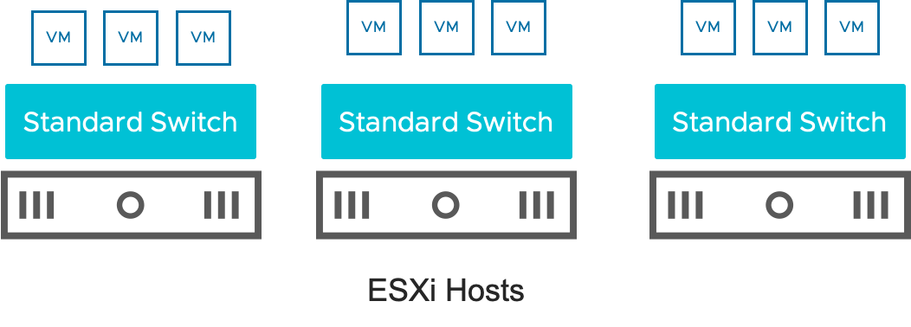
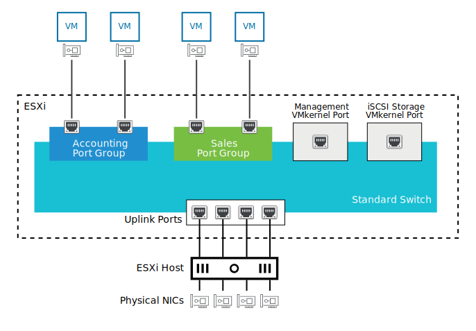
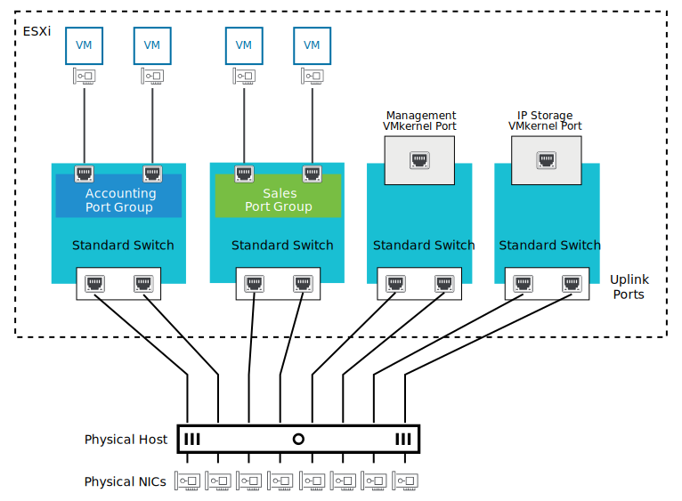
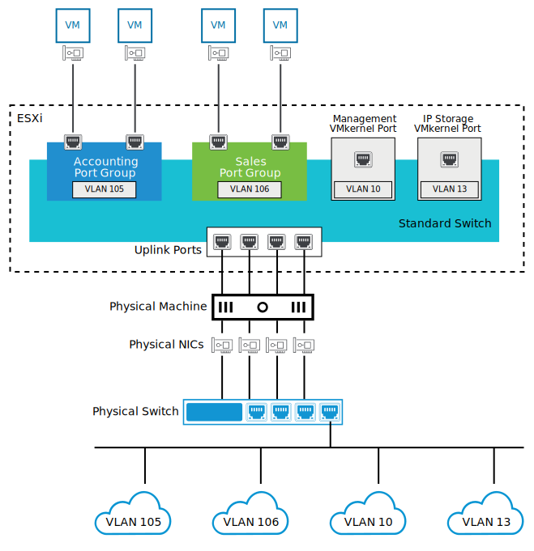

# 6. vSphere Standard Switches

Learner Objectives
- Identify characteristics of vSphere standard switches
- View components and properties of a standard switch configuration

## How vSphere Standard Switches Work

### vSphere Standard Switch

A vSphere standard switch is a virtual switch that provides virtual networking for an ESXi host and its virtual machines.

A standard switch is associated with a single ESXi host. For example, if you have three hosts that require network connectivity, then you must create a standard switch on each host.

#### Single Standard Switches: Managing Traffic

A single standard switch can be used for both VM and ESXi system traffic. The physical NICs are shared by all port groups.

In this example, different networks share the bandwidth provided by the standard switch. The standard switch manages VM traffic from the Accounting network, VM traffic from the Sales network, ESXi management network traffic, and iSCSI storage network traffic. The uplink ports pass all traffic through to the physical NICs.

### Isolating Networks

You can use standard switches to isolate different types of network traffic from each other. Why might you want to isolate networks? Consider the following reasons:
- Improve network performance: Each network has its own dedicated bandwidth and does not have to share bandwidth with other networks.
- Help prevent unauthorized monitoring or network interference by other VMs.

You can isolate networks by using either multiple standard switches or VLANs.

#### Multiple Standard Switches

You can create a separate standard switch for each of your VM port groups and VMkernel ports.

Each standard switch has its own physical NICs. Traffic from each virtual network (port group) is physically separated by each standard switch.

The downside of having separate standard switches is that the ESXi host must have enough physical NICs to support the configuration, which can be costly.

For example, with four standard switches that have two uplink ports each, the ESXi host requires eight physical NICs.

Also, an ESXi host has limits to the number of physical NICs that it can support.

#### VLANs

Instead of using separate standard switches to isolate networks, you can use a single standard switch and isolate networks using VLANs.

A VLAN (virtual LAN) is a subgroup of a physical network. VLANs can logically group VMs, systems, and devices into separate virtual networks, regardless of where they are located in the physical network.

A VLAN has a VLAN ID, which is a number that uniquely identifies the VLAN. Virtual switches and physical switches use the VLAN ID to route packets to the correct network.

Each port group on a virtual switch can be configured to use VLANs.

In this example, VM port groups and VMkernel port groups are configured to be members of specific VLANs.

Why use a single standard switch with VLANs instead of multiple standard switches to isolate networks?

##### Why Use VLANs?

In addition to improving network performance and providing additional security, VLANs do not require that you add new cabling or make significant physical changes to the network infrastructure.

VLANs must be planned and configured in your physical and virtual network infrastructure before they can be used. Therefore, if your data center already has an existing VLAN configuration in place, then you might prefer to use VLANs instead of multiple standard switches to isolate your networks.

## Knowledge

Which statements accurately describe standard switches?
- [x] A standard switch is a virtual switch that is configured for a single ESXi host.
- [ ] A standard switch differs from a virtual switch because standard switches contain VMkernel ports.
- [x] An ESXi host can contain one or more standard switches
- [ ] A standard switch is a virtual switch that is managed by vCenter Server for all the ESXi hosts.

Which properties apply to the networking components?

| - | Standard Switch | Port Group | VMkernel Port | Uplink Adapter |
| :---: | :---: | :---: | :---: | :---: |
| IPv4 settings | | | X | |
| TCP/IP stack | | | X | |
| VLAN ID | | X | | |
| Physical adapter status | | | | X |
| MTU | X | | | |