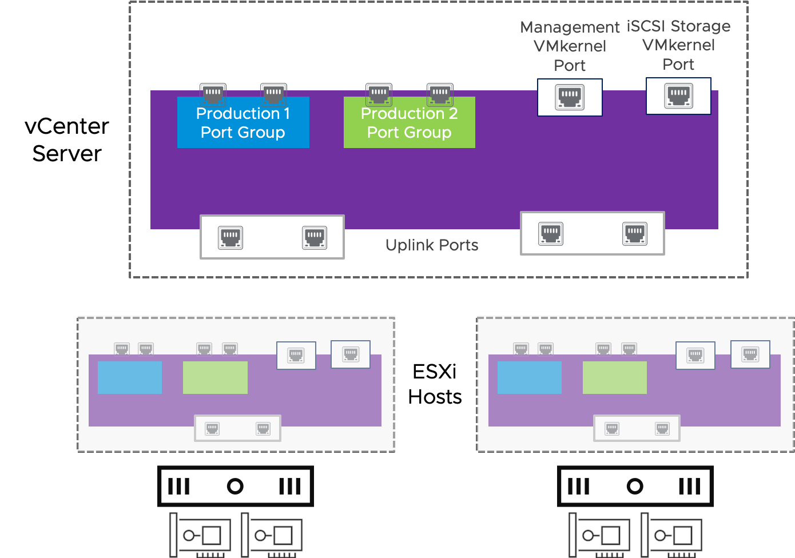

# 7. vSphere Distributed Switches

Learner Objectives
- Describe the benefits of vSphere distributed switches
- Compare distributed and standard switches
- View a distributed switch configuration in the vSphere Client

## About vSphere Distributed Switches

### Benefits of Distributed Switches

vSphere Distributed Switch is a virtual switch that provides virtual networking for all ESXi hosts in a data center.

Whereas a standard switch is owned and managed by a single ESXi host, a distributed switch is owned and managed by vCenter Server.

A distributed switch provides the following benefits:
- Virtual machines maintain a consistent network configuration as they migrate between hosts in the data center.
- Administrators have a central point of control for creating, administering, and monitoring the virtual networks.

### Distributed Switches and Standard Switches: Features

| Feature | Standard Switch | Distributed Switch |
| :--- | :---: | :---: |
| VLAN support | X | X |
| Security policy | X | X |
| NIC teaming and failover policy | X | X |
| Traffic shaping policy for outbound traffic | X | X |
| Traffic shaping policy for inbound traffic | | X |
| NetFlow | | X |
| Port mirroring | | X |
| Network I/O Control | | X |

#### Vlans

VLANs (virtual LANs) logically group VMs, systems, and devices into separate virtual networks, regardless of where they are located in the physical network. Administrators create VLANs to isolate networks, resulting in improved network performance and security for each network.

#### Security policy

You can use the virtual switch security policy to protect VMs against impersonation and interception attacks on the network.

#### NIC teaming and failover policy

The NIC teaming and failover policy is used to create a NIC team (multiple physical NICs grouped together) on the virtual switch. A NIC team provides network redundancy and load-balancing functionality.

#### The traffic shaping

The traffic shaping policy is a virtual switch mechanism for placing limits on the amount of bandwidth VMs can use for inbound and outbound traffic.

#### NetFlow

NetFlow is a network analysis tool for monitoring the network and viewing VM traffic that flows through a distributed switch. Network administrators use NetFlow for detecting potential security risks, and for determining the source of network security attacks.

#### Port mirroring

Port mirroring duplicates network packets from a source port to a destination port that is used for networking monitoring. Network administrators use port mirroring to analyze network packets when troubleshooting network problems.

##### Network I/O Control

Network I/O Control can be used to allocate network bandwidth to business-critical applications and to resolve situations where several types of traffic, including virtual machine traffic, compete for network bandwidth.

## Distributed Switch Architecture

In the distributed switch architecture, the virtual networking configuration is managed by vCenter Server:
The port group and VMkernel port configuration is automatically pushed down to all connected ESXi hosts.
Each ESXi host is responsible for managing their own uplink adapters and for forwarding packets from VMs to their destinations.

## Knowledge

Which statement accurately describes distributed switches?

- [ ] A distributed switch is a virtual switch that is configured for a single ESXi host.

- [ ] Each ESXi host can have only one distributed switch configured at any time.

- [ ] A standard switch differs from a distributed switch because standard switches contain VMkernel ports.

- [x] A distributed switch is a virtual switch that is managed by vCenter Server for all ESXi hosts.

Which features apply to distributed and standard switches?

| - | Standard Switch |	Distributed Switch |
| :---: | :---: | :---: |
| VLAN support | X | X |
| Network I/O Control | | X |
| Port mirroring | | X |
| NetFlow | | X |
| NIC teaming and failover policy | X | X |