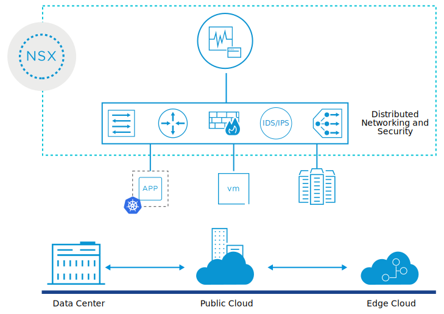

# 10. Introduction to NSX-T Data Center

Learner Objectives
- Describe the features and benefits of NSX-T Data Center
- Describe the use cases for NSX-T Data Center

## About NSX-T Data Center

Modern-day enterprises are adopting new strategies for cloud, containers, and new application frameworks. The IT teams must run, manage, and connect virtual machines and containers across multiple types of hypervisors and clouds.

NSX-T Data Center addresses the evolving needs of organizations to support cloud-native applications, bare-metal workloads, multihypervisor environments, and public clouds. NSX-T Data Center offers a full stack networking platform that includes virtual networking, security, services, and analytics.

NSX-T Data Center enables network and security services that span from any site, to any cloud, and to any endpoint device.

### Benefits of NSX-T Data Center

NSX-T Data Center provides the following advantages:
- Connects applications no matter where they reside across private and public clouds.
- Protects applications with built-in security features, including distributed firewall and threat prevention services.
- Eliminates manual configuration and achieves consistent networking and security configuration across private and public clouds.
- Provides a single access point to manage and monitor the network.
- Software-based networking and security solutions are easier to design, deploy, and manage compared to traditional hardware-based solutions.

## Use Cases for NSX-T Data Center

### Security

NSX-T Data Center offers security based on applications. This approach protects all the traffic inside the data center, and not only at the perimeter. This approach also prevents the spread of threats between internal workloads.

### Multicloud networking

NSX-T Data Center allows administrators to consistently configure networking and security services across multiple sites and cloud providers, including on-premises, private, and public cloud environments.

### Automation

NSX-T Data Center enables faster deployment of networking and security services through automation and reduces manual and error-prone tasks.

### Cloud-native applications

NSX-T Data Center enables the adoption of modern containerized solutions by connecting containers that run across multiple platforms such as vSphere with VMware Tanzu, Kubernetes, and others.

## Knowledge

Which of the following features does NSX-T Data Center provide? (choose three)

- [X] Security
- [ ] Compute Virtualization
- [ ] Physical networking
- [X] Services
- [X] Virtual Networking

What are the benefits offered by NSX-T Data Center ? (choose two)

- [ ] Increased management complexity
- [ ] Reduces operational efficiency
- [ ] More complicated deployments compared to traditional hardware-based solutions
- [X] Connect and protect applications regardless of where they run: VM, container, or bare metal
- [X] Consistent networking and security policies