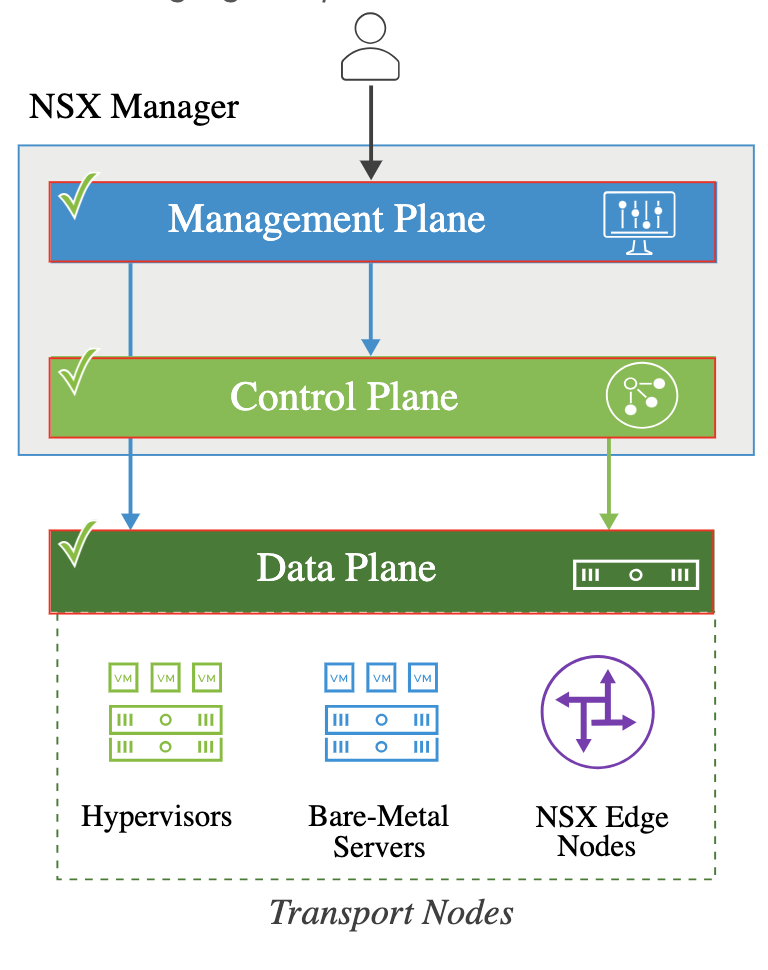

# 12. NSX-T Data Center Architecture

Learner Objectives
- Describe the­ NSX-T Data Center architecture
- Use the NSX-T Data Center user interface to validate its components

## NSX-T Data Center Architecture

In the NSX-T Data Center architecture:
The management and control planes reside in a single virtual appliance called NSX Manager.
The data plane includes a group of ESXi hosts, KVM hosts, bare-metal servers, and NSX Edge nodes that are responsible for forwarding the traffic. These servers and edges configured to participate in the NSX network are called transport nodes.

#### Managment Plane

The management plane performs the following functions:
- Provides the REST API and web-based UI interface for all user configurations
- Provides a centralized location for configuring networking and security
- Publishes the configuration to the control plane
- Installs and prepares the data plane components

#### Control Plane

The control plane performs the following functions:
- Receives the network and security configuration from the management plane and helps to realize it in the data plane
- Determines which path to use to send the traffic for logical switching, routing, and distributed firewall
- Disseminates topology changes reported by the data plane components, such as a host or network link down

#### Data Plane

The data plane performs the following functions:
- Forwards traffic based on the instructions received from the control plane
- Maintains the status of physical links and manages failover
- Maintains packet-level statistics

##### Rest API

Users can use an API to programatically access the underlying platform capabilities and features. A REST API is an API that uses HTTP requests to interact with the platform.

## Knowledge

Which components reside in the data plane of NSX-T Data Center? (choose three)

- [X] KVM hosts
- [ ] NSX Manager
- [ ] vCenter Server
- [X] NSX Edge nodes
- [X] Bare-metal servers