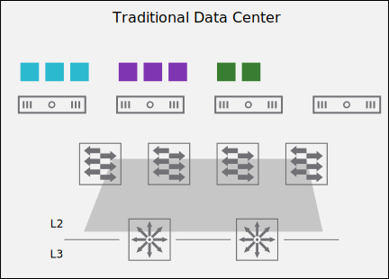
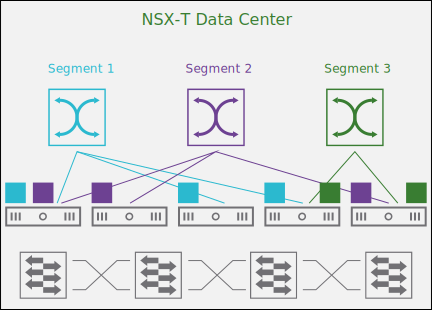

# 13. Benefits of NSX-T Data Center Logical Switching

Learner Objectives
- Describe the challenges of traditional data center switching
- Describe the benefits of NSX-T Data Center logical switching

## Traditional Data Center Switching Challenges

Traditional data center switching has limited flexibility and operation challenges.

Traditional data center switching uses dedicated hardware devices, such as switches, to provide connectivity between workloads in the same network. This approach prevents organizations from achieving a complete software-defined data center and presents limited flexibility and operational challenges for network administrators.

### Complex Configuration

The traditional data center networking revolves around the hardware devices. Network operators perform complex configurations manually device-by-device to achieve multitenancy and application isolation. This challenge results in a lack of consistency and the configuration is prone to human errors.

### Limited Workload Mobility

In traditional networks, workloads are usually confined to a single network. This approach limits workload mobility across multiple networks or subnets, unless complex Layer 2 connectivity solutions are implemented everywhere in the data center.

### VLAN Sprawl and Limitations

To logically group sets of resources to achieve multitenancy, network operators must configure and manage a growing number of VLANs to overcome IP addressing and physical topology limitations.

In addition, a historical concern with VLANs is their limited scalability. Each device can have around 4,000 usable VLANs. Service providers have this issue becuause they may have to maintain several VLANs per customer, quickly reaching the configuration limits.

### Hardware Limits

The configuration of the data center network is limited by the characteristics of the networking devices.

For example, switches operate by building a reference table of MAC addresses and corresponding switch ports, called the context-addressable memory (CAM) table. The switch can hold only a specific number of MAC addresses in this table, depending on the resources available to the switch. Beyond this limit, the switch starts to either drop or flood the traffic to all the ports.

#### Multitenancy

In cloud computing, multitenancy means that cloud providers host a software application in their data center, and provide access to multiple customers that share the underlying hardware. Each tenant is logically separated from other tenants. Multitenancy can be compared to living in an apartment block: you have an independent apartment but share the building with other neighbors.

#### Layer 2 Connectivity

Layer 2 refers to the second layer of the Open Systems Interconnection (OSI) Model, which is the data link layer. Layer 2 is concerned with the local delivery of data frames between network devices on the same network. The difference between a Layer 2 connection and a Layer 3 connection is that a Layer 3 connection involves routing, and a Layer 2 connection just involves switching.

## Benefits of NSX-T Data Center Logical Switching

NSX-T Data Center logical switching addresses the challenges of the traditional data center layer 2 networks.

The solution to these traditional data center challenges is to virtualize the network and reproduce the layer 2 services in software.

NSX-T Data Center uses software-defined switches, called segments. These segments can connect virtual machines and containers regardless of their physical location or the type of hypervisor that they are running on. NSX-T Data Center provides layer 2 connectivity without changing the underlying physical network.

### Simple and Rapid Deployment

Switching can be reconfigured quickly, and new services can be added as needed within minutes.

### Unrestricted Workload Mobility and Placement

Workloads can freely move across subnets, and their placement is not dependent on the physical topology of the network.

### Reusing the Existing Physical Topology

You do not need to change a single cable in your data center to provide switching services to your applications.

### L2 Everywhere

Segments can span across physical hosts and network switches. Regardless of the physical location of the workloads, NSX-T Data Center provides L2 connectivity.

## Knowledge

What are the characteristics of different types of logical switching approaches?

| - | Traditional Data Center Switching | NSX-T Data Center Switching |
| :---: | :---: | :---: |
| Limited workload mobility | X | |
| Spans across physical hosts and network switches | | X |
| Hardware limits | X | |
| Unrestricted workload mobility and placement | | X |
| Simple and rapid deployment | | X |
| Ability to use the existing physical topology | | X |
| Complex multitenant and application segmentation | X | |
|VLAN sprawl | X | |