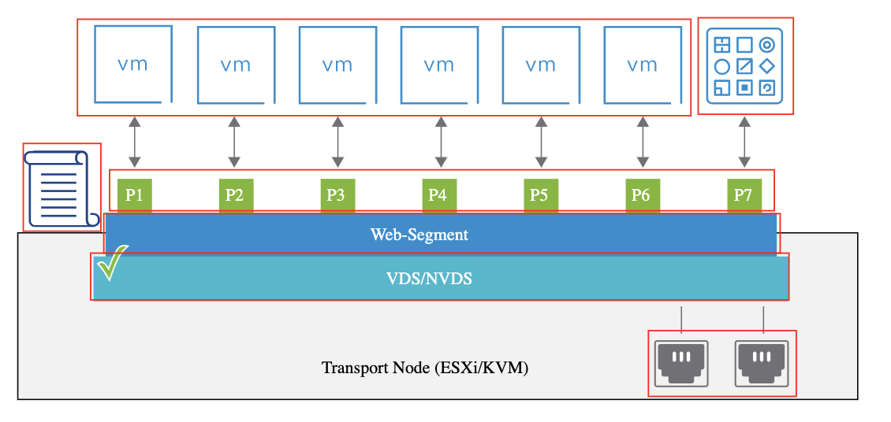
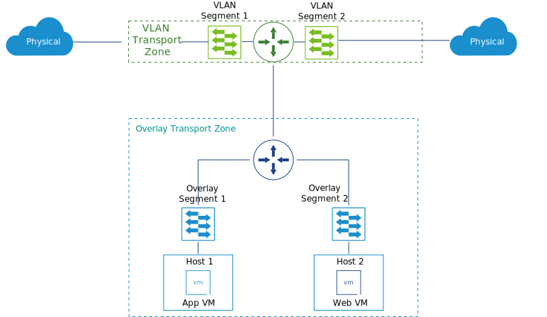

# 14. NSX Logical Switching Components

Learner Objectives
- Describe the­ components and functions of the NSX-T Data Center segments
- Identify the differences between the types of transport zones and segments

## Logical Switching Components

In NSX-T Data Center, segments connect virtual machines and containers regardless of their physical location and the type of hypervisor they are running on.

The NSX-T Data Center logical switches are called segments:
Segments separate networks and provide layer 2 connectivity to their attached VMs and containers.
VMs and containers can communicate with each other if they are connected to the same segment.
Each segment has a virtual network identifier (VNI), like a VLAN ID. However, unlike VLANs, VNIs scale beyond the limits of VLAN IDs.

Segment profiles include layer 2 networking configuration details. Segment profiles can be applied at a port level or at a segment level.

You can configure multiple types of segment profiles such as Quality of Service (QoS), IP Discovery, SpoofGuard, Switch Security, and MAC Management.

Uplinks are logical interfaces on the N-VDS/VDS. Uplinks are used to the connect the host physical NICs to provide external connectivity.

### Virtual machines

You can connect virtual machines to a segment regardless of their physical location and the type of hypervisor they are running on.

### Containers

NSX-T Data Center segments provide connectivity for containerized applications. NSX-T Data Center provides the networking layer for vSphere with VMware Tanzu.

### Segment ports

A segment contains multiple segment ports. Entities such as routers, VMs, or containers are connected to a segment through the segment ports.

## Types of Segments and Transport Zone

A transport zone defines the scope of a segment or the numbers of transport nodes (VMware ESXi™ hosts, KVM hosts, bare-metal servers, and VMware NSX® Edge™ nodes) across which it expands. A segment belongs to either a VLAN or an overlay transport zone.

### VLAN Transport Zone

The VLAN transport provides the following benefits:
- Is used to establish connectivity to external networks
- Carries VLAN or 802.1Q tagged traffic

### Overlay Transport Zone

The overlay transport zone provides the following benefits:
- Is used for communication between transport nodes
- Carries the Geneve-encapsulated traffic

## Knowledge

Which statements about overlay transport zones are true? (choose two)

- [ ] Carry VLAN or 802.1Q tagged traffic
- [x] Carry the Geneve-encapsulated traffic
- [x] Used for communication between transport nodes
- [ ] Used to establish connectivity to external networks