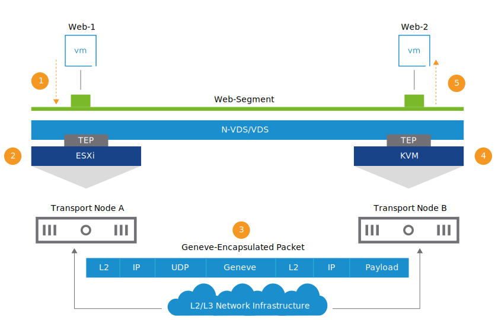
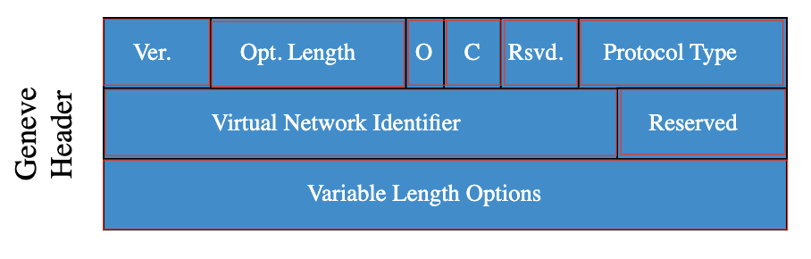

# 15. NSX Logical Switching

Learner Objectives
- Describe the end-to-end logical switching communication in VMware NSX-T™ Data Center
- Connect workloads to an existing segment and check connectivity

## Logical Switching End-to-End Communication

NSX-T Data Center uses Geneve tunneling to encapsulate the virtual network traffic and carry it over the physical network:

- Each transport node (VMware ESXi™, KVM, or bare-metal server) is configured with a tunnel endpoint (TEP) that is used to encapsulate and decapsulate the Geneve traffic as it leaves or enters the host.
- Tunnels are set up between TEPs.
- VM frames are encapsulated with Geneve tunnel headers and sent across the tunnel.

The two web servers connected to the same segment communicate with each other:
- Web-1 sends the traffic to Web-Segment.
- The source transport node encapsulates the L2 frame with the Geneve header.
- The source transport node forwards the packet to the physical network.
- The destination transport node receives the packet and performs decapsulation.
- The destination TEP forwards the L2 frame to the destination web server (Web-2).

### About Geneve Tunneling

Geneve is an overlay tunneling mechanism, which:
- Provides L2 over L3 encapsulation
- Runs on UDP
- Uses port number 6081
- Adds an 8-byte tunnel header encapsulated in UDP over either IPv4 or IPv6
- Requires a MTU size of less than 1,600 (1,700 recommended)

Geneve Header

- Version (2bits): The current version number is 0.
- Options Length (6 bits): This variable results in a minimum total Geneve header size of 8 bytes and a maximum of 260 bytes.
- O (1 bit): The Operations, Administration, and Maintenance (OAM) packet contains a control message instead of a data payload.
- C (1 bit): This field indicates that critical options are present.
- Rsvd. (6 bits): The Reserved field must be zero on transmission and ignored on receipt.
- Protocol Type (16 bits): The field indicates the type of protocol data unit appearing after the Geneve header.
- Virtual Network Identifier (VNI) (24 bits): The VNI uniquely identifies the segment that the inner Ethernet frame belongs to. It is a 24-bit number that is added to the Geneve frame, allowing a theoretical limit of 16 million separate networks. The NSX VNI range is 5,000 through 16,777,216.
- Reserved (8 bits): The Reserved field must be zero on transmission and ignored on receipt.
- Variable Length Options: The base Geneve header is followed by zero or more options in the type-length-value format. Each option includes a 4-byte option header and a variable amount of option data interpreted according to the type. Geneve provides NSX-T Data Center with the complete flexibility of inserting metadata in the type, length, and value fields that can be used for new features.