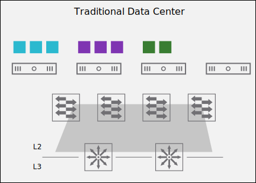

# 16. Benefits of NSX-T Data Center Logical Routing

Learner Objectives
- Describe the challenges of traditional data center routing
- Identify the benefits of NSX-T Data Center logical routing

## Traditional Data Center Routing

Traditional data center routing uses dedicated hardware devices, such as routers, to connect different networks together and to connect your applications to the Internet.

As virtualization technologies continue to expand and companies adopt agile software development practices, the amount of internal traffic in the data center is increasing. This traffic is commonly known as east-west traffic.

Traditional data center routing presents performance challenges for the modern data center. Traditional routing methods, where all the traffic is managed by physical routing devices, are not efficient in these scenarios and present performance challenges in the network. These challenges slow down the performance of the business-critical applications.

#### Hairpinning

Traffic from one application to another typically needs to traverse the physical data center network, even if those applications reside on the same physical hardware. This hairpinning of traffic introduces latency and slows the performance of your applications.

#### Increased Network Costs

To cope with the increase of east-west traffic in the modern data center, organizations must purchase additional hardware to increase the network bandwidth and mitigate the performance impact on the business-critical applications. The network and maintenance costs increase significantly, and the physical network devices are harder to manage.

#### Hardware Limits

The configuration of the data center network is limited by the characteristics of the networking devices.

For example, routers operate by building a table with the best network routes, which includes the next hop IP address for a given network and its corresponding interface. This table is called the Forwarding Information Base (FIB) table. The router can hold only a specific number of routes in this table, depending on the resources available. Beyond this limit, the router starts to drop the traffic.

## Benefits of NSX-T Data Center Logical Routing

Virtualizing the network and reproducing the layer 3 services in software can solve the traditional data center challenges.

NSX-T Data Center logical routing reduces traffic hairpinning.

NSX-T Data Center uses software-defined routers, called gateways, to connect different networks and to connect your workloads to the Internet. VMware NSX® also implements a distributed routing solution across all hypervisors to avoid hairpinning and increase the performance of your business-critical applications.

#### Reduced Hairpinning

The NSX distributed routing architecture provides optimal routing paths. Routing is done closest to the source. For example, traffic between two VMs on different subnets residing on the same host can be routed directly in the hypervisor. The traffic does not need to leave the host and traverse the physical network infrastructure to get routed. This method helps avoid hairpinning.

#### Simple and Rapid Deployment

Routing can be reconfigured quickly, and new services can be added as needed within minutes.

#### Native Support for Multitenant Environments

The logical routing functionality focuses on multitenant environments. Gateways can support multiple instances where a separation of tenants and networks are required.

##### Multitenant Enviroments

In cloud computing, multitenancy means that cloud providers host a software application in their data center, and provide access to multiple customers who share the same underlying hardware. Each tenant is logically separated from other tenants. It is like living in an apartment block: you have your independent apartment, but share the building with other neighbors.

## Knowledge

What are the benefits of NSX-T Data Center logical routing and the challenges posed by traditional data center routing?

| - | Traditional Data Center Routing | NSX-T Data Center Routing |
| :---: | :---: | :---: |
| Simple and rapid deployment | | X |
| Hairpinning | X | |
| Increased network costs | X | |
| Reduced hairpinning | | X |
| Native support for multitenant environments | | X |
| Hardware limits | X | |