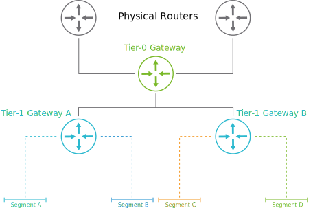
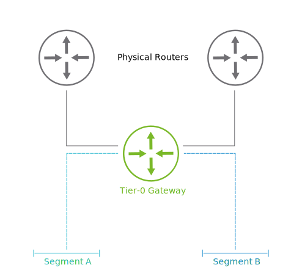

# 17. NSX Routing Components

Learner Objectives
- Describe the components and functions of NSX-T Data Center logical routing
- Identify the logical routing topologies that are available in NSX-T Data Center

## Logical Routing Components and Topologies

### Logical Routing Components

NSX-T Data Center uses software-based routers, called gateways, to connect different networks and to provide Internet access to your applications. You can configure both Tier-0 and Tier-1 gateways based on your requirements.

#### Tier-0 Gateway

Tier-0 gateways connect the virtual and physical networks to provide external connectivity to all the containers and virtual machines that run in the data center. This traffic is also called North-South traffic.

Tier-0 gateways have the following characteristics:
- Offer gateway services between VMware NSX® and the external networks.
- Require the deployment of one or more VMware NSX® Edge™ nodes to centrally configure and manage the routing capabilities.
- Support static and dynamic routing protocols (BGP) towards the physical network.
- Support equal-cost multipath (ECMP) routing to load balance traffic and provide fault tolerance.

##### BGP

Border Gateway Protocol (BGP) is a dynamic routing protocol that is used to route traffic across the Internet.

##### ECMP

Equal-Cost Multipath (ECMP) is a routing protocol that increases the external network bandwidth by adding network links.

#### Tier-1 Gateway

Tier-1 gateways are typically used to connect virtual machines and containers that are attached to different networks or segments. The internal communication across segments is also called East-West traffic.

Tier-1 gateways have the following characteristics:
- Provide segment interconnection and separation
- Offer gateway services to the internal networks or segments
- Are implemented as a distributed solution across all participating transport nodes
- Do not use any dynamic routing protocols
- Connect to a Tier-0 gateway for external connectivity

### Logical Routing Topologies

NSX-T Data Center supports different types of routing topologies based on the needs of your environment.

#### Multitier Topology

In a multitier deployment, segments are connected to the Tier-1 gateways, and the Tier-1 gateways are connected to the Tier-0 gateway.

This topology is typically used when different teams or business units manage the Tier-0 and Tier-1 gateways. For example, the cloud provider manages the Tier-0 gateways, and each tenant is responsible for its own Tier-1 gateway.

#### Single-Tier Topology

In a single-tier deployment, segments are connected directly to the Tier-0 gateway, without a Tier-1 gateway.

This topology is used when the same team or business unit manages all gateways. For example, the service provider and tenant are the same and do not need to be separated.

## Knowledge

What are the characteristics of a multitier deployment? (choose two)

- [x] Used when different teams or business units manage the gateways.
- [ ] Used when the same team or business unit manages the gateways.
- [x] Segments are connected to Tier-1 gateways and Tier-1 gateways to Tier-0 gateways
- [ ] Segments are connected directly to the Tier-0 gateway, without a Tier-1.

What are the characteristics of the different types of NSX gateways?

| - | Tier-0 Gateway | Tier-1 Gateway |
| :---: | :---: | :---: |
| Implemented as a distributed solution | | X |
| Does not use any dynamic routing protocols | | X |
| Supports equal-cost multipath (ECMP) routing. | X | |
| Offers gateway services to the internal networks or segments | | X |
| Support static and dynamic routing protocols. | X | |
| Offers gateway services between NSX and the external networks. | X | |
| Provides segment interconnection and separation | | X |
| Requires the deployment of one or mode NSX Edges nodes. | X | |