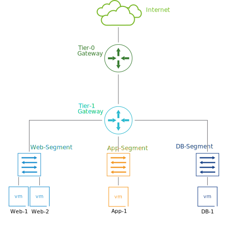

# 18. NSX Logical Routing

Learner Objectives
- Recognize the use cases for NSX logical routing
- Connect segments to a Tier-1 gateway and verify connectivity between different segments
- Connect a Tier-1 gateway to a Tier-0 gateway and verify external connectivity

## Use Case for Logical Routing

The software development team at VMBeans wants to ensure that the two new web servers can communicate with the application server and the database so that the coffee orders are successfully processed and stored.

Also, the users of the coffee delivery service need to access the two new web servers through the Internet.

You can use the VMware NSX-T™ Data Center logical routing capabilities to address these requirements. You can use a Tier-1 gateway to connect the web servers to the application and database servers, and a Tier-0 gateway to ensure that the web servers can be accessed through the Internet.

Tier-1 gateways are typically used to connect virtual machines and containers running on different networks or segments, while Tier-0 gateways are used to provide connectivity to the external networks and the Internet.

## Knowledge

What are the uses cases for NSX-T Data Center logical routing? (choose two)

- [x] Provide connectivity between VMs or containers connected to different segments.
- [ ] Provides layer 2 connectivity between VMs and microservices.
- [ ] Provides intrinsic security for VMs connected to different segments.
- [x] Provide external connectivity to VMs and containers.

A team of software developers recently deployed a three-tier application that includes web servers, application servers, and database servers. These servers are currently connected to different segments.
The junior network administrator must ensure that the servers of the three-tier application can communicate with each other. Users must also be able to access the three-tier application from the external network. A multitier deployment must be used.
What are the steps that the administrator must perform to complete this task? (choose two)

- [x] Connect the Tier-1 gateway to the Tier-0 gateway from the NSX UI.
- [ ] Connect the Tier-1 gateway to the external router from the NSX UI.
- [x] Connect the three segments to a Tier-1 gateway from the NSX UI.
- [ ] Connect the three segments to a Tier-0 gateway from the NSX UI.
- [ ] Connect the three segments to the external router from the NSX UI.