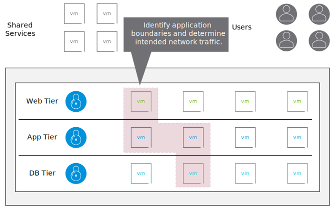
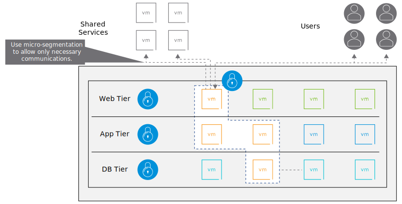
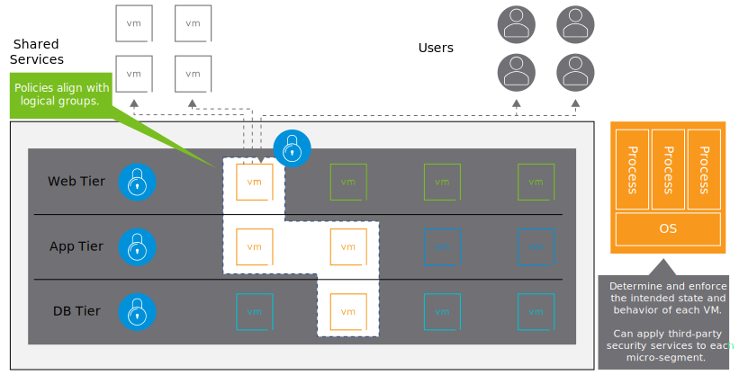

# 20. Zero-Trust Security

Learner Objectives
- Implement the Zero-Trust approach for security by using micro-segmentation

## About the Zero-Trust Approach for Security

Conventional security models assume that all users and components in an organization's network can be trusted.

The Zero-Trust model assumes the opposite: trust nothing and verify everything.

This architecture addresses the increased sophistication of network attacks and insider threats that frequently exploit the conventional approach to only secure the perimeter.

## Using Micro-Segmentation to Implement a Zero-Trust Approach

Micro-segmentation helps to build a Zero-Trust approach to security by defining a security perimeter around each application. This method prevents an attacker from moving in the data center.

### Step 1: Identify the application boundaries

To build the zero-trust security data center, determine the VMs that contain an application and the network traffic that is necessary for the application to function.

### Step 2: Create micro-segments

When you understand an application’s composition and necessary network traffic, you can create micro-segmentation policies to restrict unnecessary network traffic. This step immediately reduces the attack surface of the application by restricting the application to only communicating with the resources that it absolutely needs.

### Step 3: Secure through context

Use security policies to establish how the virtual machines and containers should behave, including the processes that should be running and how the OS should be configured. This step secures the traffic and the context of the application.

## Knowledge

What is the order of the steps to implement the Zero-Trust model?

- [2] Create micro-segments
- [3] Secure through context
- [1] Identify the application boundaries

Which NSX technology helps the security administrator to implement a Zero-Trust security architecture?

- [ ] Gateway firewall
- [x] Micro-segmentation
- [ ] Perimeter firewall
- [ ] Microservices