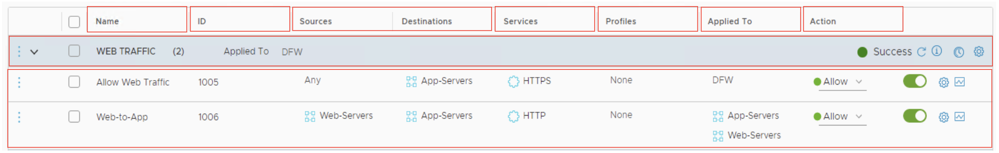

# 21. NSX Firewalls

Learner Objectives
- Differentiate between gateway and distributed firewalls
- Identify preconfigured firewall rules from the NSX UI
- Validate preconfigured firewall rules from the NSX UI

## Use Case for NSX Firewalls

The VMBeans database is publicly accessible through the Internet. A security breach occurred in the coffee delivery service webpage. One of the users, who was disappointed with the allocated delivery slot, hacked the database to change the delivery slot to an earlier delivery time.

In addition, a recently hired intern made some cosmetic changes to the web interface. The intern accidentally used commands that deleted a few users.

NSX-T Data Center firewalls can help resolve these security problems:
- Gateway firewalls prevent users from accessing your servers through the Internet.
- Distributed firewalls prevent web developers from accidentally accessing your database and deleting valuable information.

## About NSX Firewalls

NSX-T Data Center includes gateway and distributed firewalls to protect your data center.

The distributed firewall is an NSX-T Data Center feature that implements micro-segmentation to build a Zero-Trust security approach.

### Gateway Firewall

The gateway firewall is used at the perimeter of the data center to protect traffic to and from physical environments. **This traffic is also called North-South traffic.**

The gateway firewall has the following features:
- Applies to Tier-0 and Tier-1 gateways and their uplinks
- Requires the deployment of an NSX Edge cluster
- Supports stateless and stateful firewall rules

#### Stateless firewall rules

Stateless firewall rules allow or deny traffic based on the source, destination, and protocol or port combination of the packet.

#### Stateful firewall rules

Stateful firewall rules perform packet inspection and track the state of network connections. Packets matching a known active connection are allowed, whereas packets that do not match are evaluated in a stateless manner.

### Distributed Firewall

The distributed firewall protects traffic between virtual machines and containers in the data center. **This traffic is also called East-West** or lateral traffic:

The distributed firewall has the following features:
- Is a distributed solution that runs on each transport node (VMware ESXi™ and KVM)
- Is applied to the virtual machine vNIC
- Supports layer 2, layer 3, and context-aware (layer 7) firewall rules.
- Supports Identity Firewall for Windows systems.

#### Layer 2
the Data Link layer, of the OSI model ensures that data can be transferred between computers that are connected to the same network. Most network switches operate at Layer 2.

#### Layer 3
the Network layer, of the OSI model is responsible for routing messages between computers. Routing finds the appropriate path through the network when a computer needs to send a packet to another computer in a different network.

#### Layer 7
The highest layer of the OSI model, or the Application layer, deals with techniques that computer programs use to communicate with the network. HTTP is one of the most commonly used application layer protocols.

#### Identity Firewall 
Allows or denies network traffic based on users and user groups.

## Security Policies and Rules

You can create both distributed and gateway firewall rules to secure traffic in your data center.

Firewall rules are a set of instructions that determine whether the network traffic should be blocked or allowed based on specific criteria.

A security policy is a set of firewall rules that are related to each other.

Firewall rules are processed top to bottom:
- Each packet is matched against the first rule in the policy before moving to the next rule.
- The first rule in the policy that matches the traffic parameters is applied. Subsequent rules are not evaluated.

ID is the rule identifier that the system generates. This value cannot be modified.

The source determines the origin of the traffic.

The destination determines the location to which the traffic is sent.

You can create static or dynamic groups of virtual machines, virtual interfaces, segments, segment ports, IP and MAC addresses, Active Directory user groups, and physical servers. You can use these groups as sources and destinations in your firewall rules.

A service defines a port and protocol combination. The service is used to specify the type of traffic to be blocked or allowed in the firewall rules, for example, HTTP and port 80.

A profile inspects the layer 7 application content of the packets before allowing or denying it.

The Applied To field determines the scope of the rule enforcement. It helps to narrow down the application of security policies to specific workloads or tenants without affecting others.

The action of the firewall determines how the traffic is handled. The possible options are Allow, Drop, and Reject.
Rejecting a packet is a more graceful way to deny a packet, because it sends a destination unreachable message to the sender.

## Knowledge

What are the characteristics of different  firewalls?

| - | Gateway Firewall | Distributed Firewall |
| :---: | :---: | :---: |
| Runs on each transport node | | X |
| Applies to Tier-0 and Tier-1 gateways and their uplinks | X | |
| Protects North-South Traffic | X | |
| Requires the deployment of an NSX Edge cluster | X | |
| Protects East-West Traffic | | X |
| Is applied to the virtual machine vNIC. | | X |

What is the Applied To field used for when creating an NSX firewall rule?

- [ ] Determines that layer 7 traffic should be analyzed
- [x] Determines the scope of the rule enforcement
- [ ] Determines how the traffic is handled
- [ ] Defines a port and protocol combination

Which statement is true about the firewall rule in the screenshot?

- [ ] It is a distributed firewall applied to App-Servers, DB-Servers, and Web-Servers, which drop the traffic on port 22.
- [ ] It is a gateway firewall applied to a Tier-1 gateway, which rejects the traffic on port 22.
- [ ] It is a distributed firewall applied to App-Servers, DB-Servers, and Web-Servers, which reject the traffic on port 22.
- [x] It is a gateway firewall applied to a Tier-0 gateway, which drops the traffic on port 22.