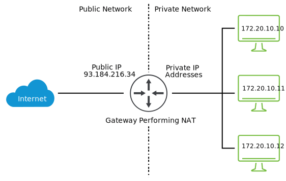
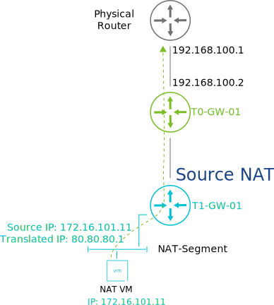
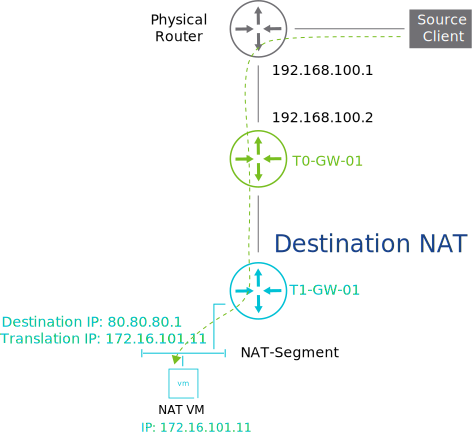

# 24. NSX NAT

Learner Objectives
- Describe NAT and its use cases
- Implement NAT in VMware NSX-T™ Data Center

## Use Case for NAT

A limited number of public IP addresses are assigned to VMBeans. The number of available IP addresses is not enough to configure each of the company's web servers with a dedicated public IP address. VMBeans needs to use a private IP address to connect servers to the Internet without revealing the server's IP address.

NAT is a mechanism used to translate between private IP addresses and public IP addresses. A private IP address is not globally unique and cannot be used to access the Internet directly. A public IP address is unique, but IP version 4 public addresses are limited because all the devices are now on the Internet. NAT performs one-to-one or one-to-many mapping, which allows computers that use private IP addresses to access the Internet. The private IP addresses, which are used internally, are not revealed.

#### NAT

Network Address Translation is the process where a network device, usually a router or gateway, assigns a public address to a computer (or group of computers) in a private network. NAT reduces the number of public IP addresses that an organization needs to use.

#### Private IP
Private IP addresses are used to communicate within the same network without any exposure to the Internet.

#### Public IP
An Internet Service Provider (ISP) assigns a public IP address. The public IP address can be used to communicate over the Internet.

#### One-to-one mapping
One public IP address is mapped to one private IP address

#### One-to-many mapping
One public IP address is mapped to multiple private IP addresses.

## Implementing NAT in NSX-T Data Center

NSX-T Data Center enables you to create both source NAT (SNAT) and destination NAT (DNAT) rules. You can configure SNAT and DNAT rules on both Tier-0 and Tier-1 gateways.

### Source NAT

SNAT translates the source IP packets from a private IP address to a known public IP address. SNAT is used for traffic originating in the private network and reaching the Internet.

### Destination NAT

DNAT translates the destination public IP address to a private IP. DNAT is used for traffic originating on the Internet and reaching the private network.

## Knowledge

What does NAT translate a private IP address to?

- [ ] Domain name address
- [ ] Public gateway address
- [ ] Public MAC address
- [X] Public IP address

Which types of NAT rules do NSX-T Data Center support? (choose two)

- [X] Source NAT
- [X] Destination NAT
- [ ] Static NAT
- [ ] Dynamic NAT