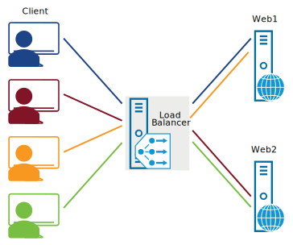
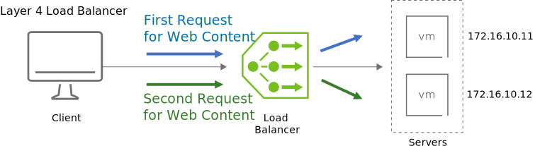
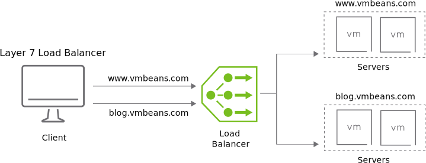

# 25. NSX Load Balancing

Learner Objectives
- Describe load balancing and its use cases
- Implement load balancing in NSX-T Data Center

## Use Case for Load Balancing

As VMBeans continues to expand, additional web servers are required to ensure good service to customers. VMBeans also needs a way to spread the work across all the web servers, so that one server is not continuously under pressure while the remaining web servers are idle.

The NSX-T Data Center load balancer distributes incoming service requests among multiple servers and offers high availability for applications

### Use Cases for Load Balancing

You use load balancing when:
- Server redundancy is required to prevent outages.
- Fast response time is required by spreading client requests across multiple servers.
- Relief is needed when certain servers are heavily loaded.

### Benefits of Load Balancing

Load balancing provides the following advantages:
- Provides high availability for applications: If one server fails, the workload can be handled by the remaining group members.
- Easily add more servers to the group to meet demand.
- Removes performance bottlenecks by spreading the workload among group members.
- Eliminates downtime: Remove a server from the group, for maintenance, without causing any disruption.

## Implementing Load Balancing in NSX-T Data Center

NSX-T Data Center supports both layer 4 and layer 7 load balancing. The NSX-T Data Center load balancer is supported only on Tier-1 gateways.

### Layer 4 Load Balancer

The layer 4 load balancer operates at the transport layer with protocols such as TCP and UDP. The layer 4 load balancer does not look inside the network packets. The load balancer spreads the load across multiple servers without considering the content. The load balancer generally calculates the best server to send the traffic to based on the number of current connections, server response times, or alternating between all the servers in the group.

### Layer 7 Load Balancer

The layer 7 load balancer operates at the application layer and inspects the content of the packets. Using protocols such as HTTP and HTTPS, the load balancer can uniquely identify client sessions and use this information to deliver all client requests to the same server. The NSX layer 7 load balancer also allows URL manipulation through user-defined rules.

#### TCP

Transmission Control Protocol is a standard to define how a connection is established and maintained until the application programs at each end have finished exchanging messages. TCP provides an error-free data transmission. It handles the retransmission of dropped packets and acknowledges all packets that arrive.

#### UDP

User Datagram Protocol is a communications protocol that is used for establishing low-latency and loss-tolerating connections between applications on the Internet. UDP is optimized for speed and does not guarantee error-free transmission of data.

#### HTTP

Hypertext Transfer Protocol is a communications protocol that is used to connect to web servers. Its primary function is to establish a connection with the server and send HTML pages to the user's browser. HTTP is an unsecured protocol. It does not encrypt the communication between the user's browser and the web server.

#### HTTPS

Hypertext Transfer Protocol Secure is a communications protocol used to connect to Web servers. It is similar to HTTP but unlike HTTP, HTTPS uses encryption to protect the communication between the user's browser and the web server.

#### URL manipulation

The URL is the address of a webpage on the Internet. The URL appears in the browser address bar. URL manipulation allows the modification of the URL or HTTP header contents as the traffic transits the load balancer.

## Knowledge

Which use cases support load balancing?
(choose two)

- [X] Improve application response time
- [ ] Increase application complexity
- [X] Eliminate application downtime
- [ ] Degrades application response time

On which NSX-T Data Center Gateway types is the load balancing service supported?

- [ ] Tier-0 only.
- [ ] Tier-0 and Tier-1
- [X] Tier-1 only.