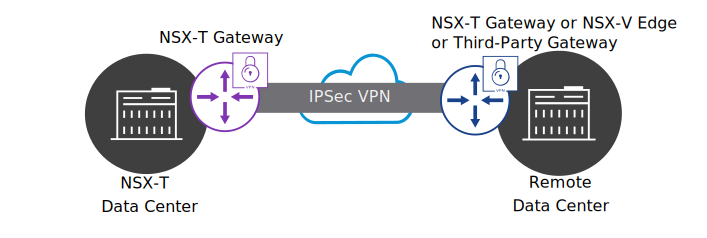

# 26. NSX VPNs

Learner Objectives
- Describe VPN technologies and their use cases
- Implement VPN technologies in NSX-T Data Center

## Use Case for VPNs

VMBeans is expanding and must outsource the maintenance and patching of its servers to an external company. VMBeans must also ensure that its partners can securely access and patch its servers from the partner's network. Also, during busy periods, VMBeans must be able to move its web servers to another data center with more capacity, without changing the IP addresses.

IPSec and layer 2 VPN can help to resolve these challenges:
- IPSec VPN creates a secure communication channel over a public network, such as the Internet, to interconnect your data center with remote sites.
- Layer 2 VPN extends or stretches layer 2 networks (VNIs or VLANs) across multiple sites, allowing you to migrate VMs between sites without changing their IP addresses.

#### IPSec

IP Security (IPSec) is a framework of protocols that are used together to set up encrypted connections between devices.

#### VPN

A virtual private network (VPN) creates a secure connection to another network over the Internet.

#### VNIs

Virtual Network Identifier (VNI) is like a VLAN ID. VNIs are used to identify NSX logical switches or segments. 

#### VLAN

A virtual LAN (VLAN) is a group of devices on one or more LANs that are configured to communicate as if they are attached to the same wire, when they are located on different LAN segments. Each group of such devices is identified by using a VLAN ID.

## Implementing VPNs in NSX-T Data Center

NSX-T Data Center, supports the configuration of IPSec and layer 2 VPN on both Tier-1 and Tier-0 gateways.

### IPSec VPN

You can use IPSec VPN to create a secure connection between NSX-T Data Center and a remote site. This remote site can be another NSX-T Data Center instance, a data center that runs NSX Data Center for vSphere, or a data center that uses an IPSec gateway from a third-party vendor.

After the IPSec connection is established, you can securely transmit encrypted data between the data centers over the Internet.

### Layer 2 VPN

You can use a layer 2 VPN to extend a network over two different NSX-T Data Center sites. Both VNI and VLAN networks can be extended, allowing you to move virtual machines between data centers without changing their IP addresses.

At present, you can only create layer 2 VPN connections between two sites that use NSX-T Data Center. Third-party interoperability is not possible.

## Knowledge

Which VPN type creates a secure communication channel over the Internet to interconnect your data center with remote sites?

- [ ] Layer 7 VPN
- [ ] SSH VPN
- [X] IPSec VPN
- [ ] Layer 2 VPN

Which VPN type allows you to migrate VMs between sites without changing their IP addresses?
- [ ] IPSec VPN
- [x] Layer 2 VPN
- [ ] SSH VPN
- [ ] Layer 7 VPN