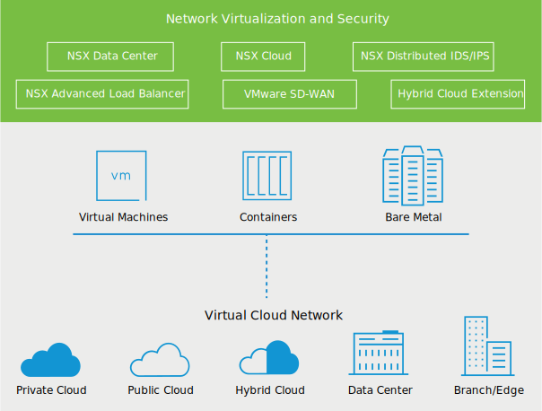
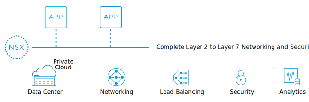
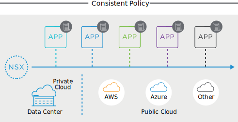
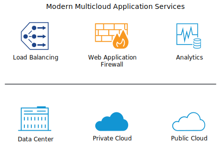
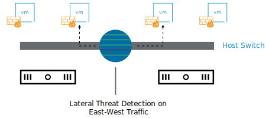
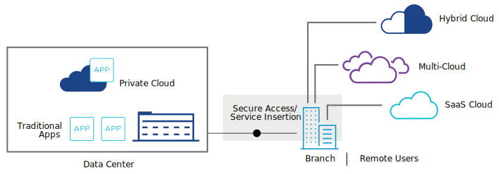
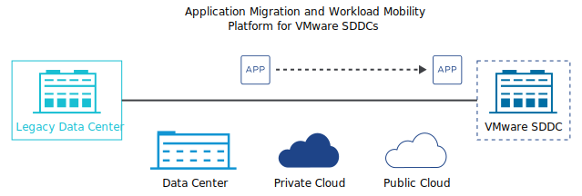
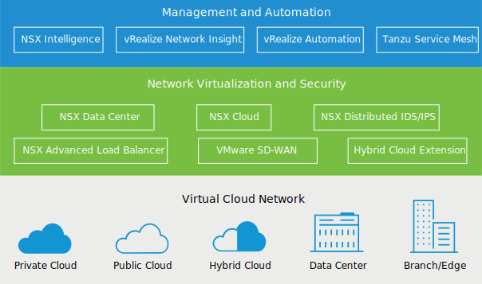

# 27. VMware Virtual Cloud Network

Learner Objectives
- Explain the VMware Virtual Cloud framework
- Describe the VMware Virtual Cloud product portfolio, its benefits, and use cases

## About VMware Virtual Cloud Network

The network of the future is virtualized, distributed, and software-defined. The VMware networking and security portfolio delivers on that future by creating a virtual cloud network that connects and protects applications across private clouds, public clouds, and edge devices.

This solution provides consistent policies across heterogeneous environments, simplified operations, and lower costs. The virtual networking and security capabilities extend to any workload that runs in VMs, containers, or bare-metal servers.

### VMware Virtual Cloud Network Portfolio Overview
The Virtual Cloud Network offers a complete portfolio of products that provide security, integration, extensibility, and automation.

#### NSX Data Center

VMware NSX® Data Center is the industry's only complete layer 2 to layer 7 software-defined networking stack, including networking, load balancing, security, and analytics. With NSX Data Center, you can provision networking and security services across multiple hypervisors and bare-metal servers.

| Benefits | Use Cases |
| :--- | :--- |
| - Accelerates deployments  - Provides consistent network and security across multiple hypervisors.  - Cost savings | - Automation  - Micro-segmentation  - Extending networking across multiple environments  - Containerized applications|

##### Micro-segmentation

Micro-segmentation is a security architecture that establishes a security perimeter around each VM or container workload with dynamically defined policies.

#### NSX Cloud

VMware NSX Cloud™ extends the networking and security capabilities of NSX Data Center to the public cloud. You can provide your workloads running natively on Amazon AWS or Microsoft Azure with consistent networking and security policies, helping you improve scalability, control, and visibility.

| Benefits | Use Cases |
| :--- | :--- |
| - Deployment flexibility  - Centralized management interface  - Integration with existing tools | - Micro-segmentation - Consistent policy management across clouds |

#### NSX Advanced Load Balancer

VMware NSX® Advanced Load Balancer™ (formerly Avi Networks) provides multicloud load balancing, web application firewall, and application analytics across on-premises data centers and cloud.

| Benefits | Use Cases |
| :--- | :--- |
| - Multicloud consistency - Full life cyle automation - Real-time analytics - Supports cloud-native applications| - Software-defined load balancer - Load balancing and web application firewalling across multicloud environments - Container Ingress Services|

##### Container Ingress
Management for incoming external traffic towards containerized applications

NSX Distributed IDS/IPS

Click to enlarge
VMware NSX® Distributed IDS/IPS™ is an advanced threat detection engine that detects lateral threat movement on east-west traffic across multicloud environments.

| Benefits | Use Cases |
| :--- | :--- |
| - Operationally simple - Removes the need for buying expensive appliances - Scales linearly by using CPU resources across multiple servers | - Create virtual zones without requiring physical separation of network. - Replace traditional security appliances - Detect lateral threat movement|

#### VMware SD-WAN

VMware SD-WAN by VeloCloud virtualizes WAN connections to deliver high-performance, reliable branch access to cloud services, private data centers, and SaaS-based enterprise applications.

| Benefits | Use Cases |
| :--- | :--- |
| - Simplified WAN operations - Improved application performance - Ease of cloud adoption - Choices in edge security | - Bandwidth expansion - Branch deployment automation |

#### VMware HCX

VMware HCX® makes it easy to migrate thousands of virtual machines within and across data centers or clouds, without requiring a reboot.

| Benefits | Use Cases |
| :--- | :--- |
| -Any-to-any mobility - Secure and large-scale migrations - Provides a hybrid interconnect optimized for WAN traffic| - Application migration across data centers and clouds. - Workload rebalancing - Business continuity |

## Additional VMware NSX Products

You can further extend the value of the NSX portfolio with an additional complement of VMware products.

#### VMware NSX® Intelligence™ 

VMware NSX® Intelligence™ is a distributed analytics solution that provides visibility and dynamic security policy enforcement for NSX Data Center environments.
NSX Intelligence enables network and application security teams to deliver a more granular security posture, simplify compliance analysis, and enable proactive security.

#### VMware vRealize® Network Insight™

VMware vRealize® Network Insight™ provides visibility across virtual and physical networks. It helps with operations management for NSX Data Center and NSX Cloud.

#### VMware vRealize® Automation™

VMware vRealize® Automation™ is the VMware infrastructure automation platform for the modern software-defined data center. When used with NSX, it automates an application's network connectivity, security, performance, and availability, saving you time and money, and increasing your security.

#### VMware Tanzu™M Service Mesh™

VMware Tanzu™M Service Mesh™, built on VMware NSX® is the VMware enterprise-class service mesh solution that provides consistent control and security for microservices, end-users, and data across the most demanding multicluster and multicloud environments.
